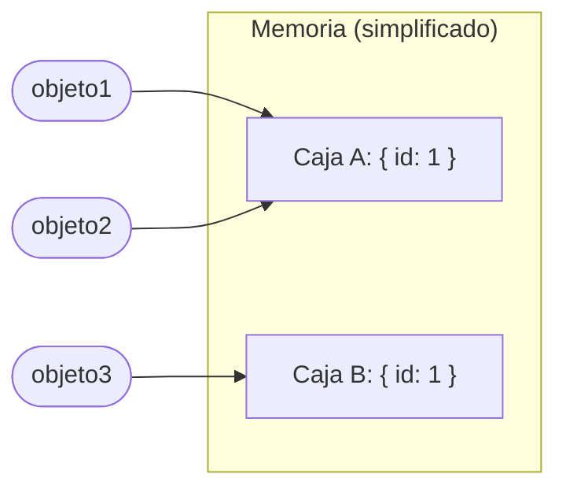
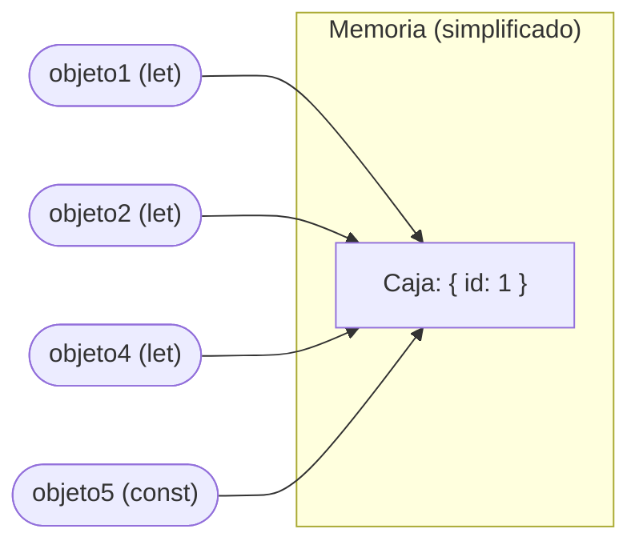
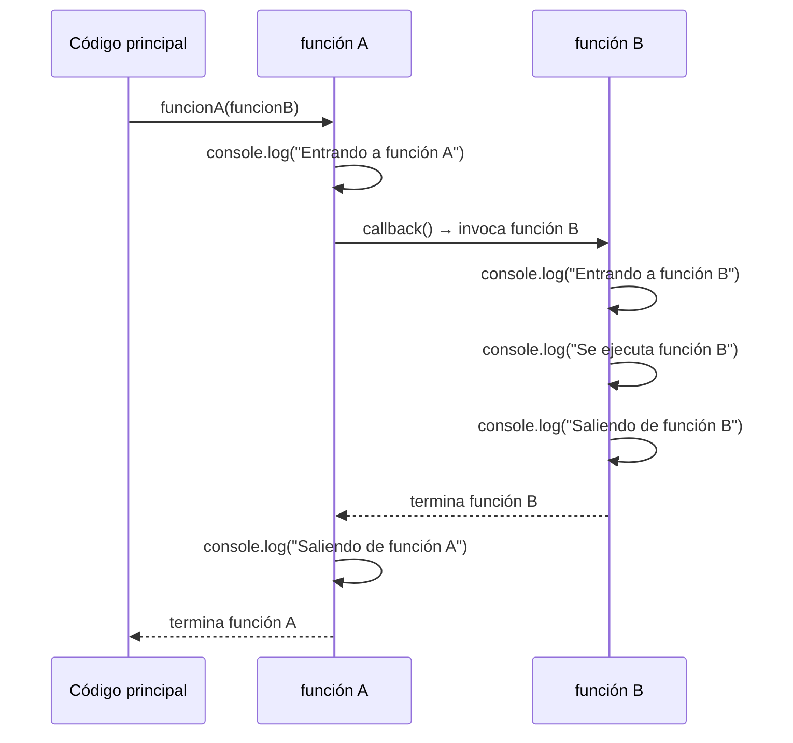

# Backend — Biblioteca de Conceptos

Apuntes de referencia de la materia **Desarrollo de Sistemas Web - BackEnd**, IFTS N°11. Profesor: Zammataro Gustavo.

> Este archivo se organiza por concepto, no por orden cronológico de clases. El orden real en que se dio cada tema queda registrado en `bitacora.md` y en el historial de commits.

## Índice

- [Backend — Biblioteca de Conceptos](#backend--biblioteca-de-conceptos)
  - [Índice](#índice)
  - [Unidad 1 — Repositorios: Administración de proyectos y código](#unidad-1--repositorios-administración-de-proyectos-y-código)
    - [1. Sistemas de Control de Versiones (VCS)](#1-sistemas-de-control-de-versiones-vcs)
      - [1.1 ¿Qué es un VCS?](#11-qué-es-un-vcs)
      - [1.2 Tipos de sistemas de control de versiones](#12-tipos-de-sistemas-de-control-de-versiones)
      - [1.3 Ejemplos de VCS y repositorios online](#13-ejemplos-de-vcs-y-repositorios-online)
    - [2. Git](#2-git)
      - [2.1 ¿Qué es Git?](#21-qué-es-git)
      - [2.2 Conceptos clave](#22-conceptos-clave)
      - [2.3 Áreas de trabajo y flujo local](#23-áreas-de-trabajo-y-flujo-local)
      - [2.4 Estados de los archivos](#24-estados-de-los-archivos)
      - [2.5 Configuración inicial de Git](#25-configuración-inicial-de-git)
      - [2.6 Comandos de consola / sistema operativo (no son de Git)](#26-comandos-de-consola--sistema-operativo-no-son-de-git)
    - [3. Comandos de Git](#3-comandos-de-git)
      - [3.1 Tabla general de comandos](#31-tabla-general-de-comandos)
      - [3.2 git init / git clone](#32-git-init--git-clone)
      - [3.3 git add / git status](#33-git-add--git-status)
      - [3.4 git commit / git push / git pull / git fetch](#34-git-commit--git-push--git-pull--git-fetch)
      - [3.5 git restore](#35-git-restore)
      - [3.6 git stash](#36-git-stash)
      - [3.7 git branch, git checkout y git switch](#37-git-branch-git-checkout-y-git-switch)
      - [3.8 git merge, squash y rebase](#38-git-merge-squash-y-rebase)
      - [3.9 Resolución de conflictos de merge](#39-resolución-de-conflictos-de-merge)
    - [4. Flujo de trabajo completo (Git Workflow)](#4-flujo-de-trabajo-completo-git-workflow)
    - [5. .gitignore](#5-gitignore)
    - [6. GitFlow](#6-gitflow)
    - [7. Repositorios remotos y SSH](#7-repositorios-remotos-y-ssh)
      - [7.1 ¿Por qué SSH y no usuario/contraseña?](#71-por-qué-ssh-y-no-usuariocontraseña)
      - [7.2 Generar una clave SSH](#72-generar-una-clave-ssh)
      - [7.3 Cargar la clave pública en GitHub](#73-cargar-la-clave-pública-en-github)
      - [7.4 Clonar un repositorio con SSH y el error más común](#74-clonar-un-repositorio-con-ssh-y-el-error-más-común)
      - [7.5 Crear un repositorio remoto en GitHub](#75-crear-un-repositorio-remoto-en-github)
      - [7.6 Colaboradores](#76-colaboradores)
    - [8. Seguridad y reglas de protección de ramas (GitHub)](#8-seguridad-y-reglas-de-protección-de-ramas-github)
      - [8.1 Pull Request (PR / MR)](#81-pull-request-pr--mr)
      - [8.2 Branch protection rules](#82-branch-protection-rules)
      - [8.3 Eliminación automática de ramas al mergear](#83-eliminación-automática-de-ramas-al-mergear)
    - [9. Herramientas complementarias](#9-herramientas-complementarias)
      - [9.1 Git Graph (extensión de VS Code)](#91-git-graph-extensión-de-vs-code)
    - [10. Programas utilizados en la materia](#10-programas-utilizados-en-la-materia)
  - [Ejemplo práctico — Sesión de consola: SSH, ramas y stash](#ejemplo-práctico--sesión-de-consola-ssh-ramas-y-stash)
  - [Unidad 2 — JavaScript](#unidad-2--javascript)
    - [11. Tipos de lenguajes de programación](#11-tipos-de-lenguajes-de-programación)
    - [12. Scripts y lenguajes de scripting](#12-scripts-y-lenguajes-de-scripting)
    - [13. EcmaScript y motores de JavaScript](#13-ecmascript-y-motores-de-javascript)
    - [14. ¿Y TypeScript?](#14-y-typescript)
    - [15. Sintaxis básica de uso frecuente](#15-sintaxis-básica-de-uso-frecuente)
    - [16. Variables en JavaScript](#16-variables-en-javascript)
    - [17. Tipos de datos](#17-tipos-de-datos)
    - [18. Operadores de comparación (`==` vs `===`) y `null` vs `undefined`](#18-operadores-de-comparación--vs--y-null-vs-undefined)
    - [19. Condicionales](#19-condicionales)
    - [20. Objetos](#20-objetos)
      - [20.1 Sintaxis: creación e inicialización](#201-sintaxis-creación-e-inicialización)
      - [20.2 Propiedades: lectura y asignación](#202-propiedades-lectura-y-asignación)
      - [20.3 Objetos declarados con `const`: qué se puede modificar y qué no](#203-objetos-declarados-con-const-qué-se-puede-modificar-y-qué-no)
      - [20.4 Paso por referencia vs. paso por valor](#204-paso-por-referencia-vs-paso-por-valor)
      - [20.5 Mutabilidad, inmutabilidad y *race conditions*](#205-mutabilidad-inmutabilidad-y-race-conditions)
      - [20.6 Objetos incorporados en JavaScript](#206-objetos-incorporados-en-javascript)
      - [20.7 JSON: `JSON.stringify` y `JSON.parse`](#207-json-jsonstringify-y-jsonparse)
    - [21. Funciones](#21-funciones)
      - [21.1 Formas de definir una función](#211-formas-de-definir-una-función)
      - [21.2 Parámetro vs. argumento](#212-parámetro-vs-argumento)
      - [21.3 Funciones como objetos y callbacks (introducción)](#213-funciones-como-objetos-y-callbacks-introducción)
      - [21.4 Ejemplo: callback en una función calculadora](#214-ejemplo-callback-en-una-función-calculadora)
      - [21.5 Firma de una función (*function signature*)](#215-firma-de-una-función-function-signature)
      - [21.6 *Hoisting*: por qué gana la última definición](#216-hoisting-por-qué-gana-la-última-definición)
      - [21.7 Alcance (*scope*) de una variable declarada dentro de una función](#217-alcance-scope-de-una-variable-declarada-dentro-de-una-función)
    - [22. Profundización de funciones callback](#22-profundización-de-funciones-callback)
      - [22.1 Función de orden superior (*higher-order function*)](#221-función-de-orden-superior-higher-order-function)
      - [22.2 Toda callback recibida como parámetro se tiene que invocar internamente](#222-toda-callback-recibida-como-parámetro-se-tiene-que-invocar-internamente)
      - [22.3 Pasar la función, no su ejecución](#223-pasar-la-función-no-su-ejecución)
      - [22.4 Buena práctica: la callback como último parámetro](#224-buena-práctica-la-callback-como-último-parámetro)
      - [22.5 Múltiples callbacks](#225-múltiples-callbacks)
      - [22.6 Orden de ejecución: una función no termina hasta que termina lo que invoca](#226-orden-de-ejecución-una-función-no-termina-hasta-que-termina-lo-que-invoca)
    - [23. Arrays](#23-arrays)
      - [23.1 Elementos e índices](#231-elementos-e-índices)
      - [23.2 Arrays fuertemente tipados vs. arrays en JavaScript](#232-arrays-fuertemente-tipados-vs-arrays-en-javascript)
      - [23.3 Formas de crear un array](#233-formas-de-crear-un-array)
      - [23.4 Los arrays son objetos: acceso a sus métodos](#234-los-arrays-son-objetos-acceso-a-sus-métodos)
      - [23.5 Métodos que modifican el array original](#235-métodos-que-modifican-el-array-original)
      - [23.6 `forEach`: iteración con una callback](#236-foreach-iteración-con-una-callback)
      - [23.7 `filter`: filtrar elementos según una condición](#237-filter-filtrar-elementos-según-una-condición)
      - [23.8 `map`: transformar cada elemento en un array nuevo](#238-map-transformar-cada-elemento-en-un-array-nuevo)
      - [23.9 `find` y `findIndex`: buscar un elemento puntual](#239-find-y-findindex-buscar-un-elemento-puntual)
      - [23.10 `some` y `every`: verificar una condición sobre el array](#2310-some-y-every-verificar-una-condición-sobre-el-array)
      - [23.11 `fill`: rellenar o reemplazar elementos por posición](#2311-fill-rellenar-o-reemplazar-elementos-por-posición)
      - [23.12 `splice`: agregar, eliminar y reemplazar en un mismo método](#2312-splice-agregar-eliminar-y-reemplazar-en-un-mismo-método)
      - [23.13 `slice`: copiar una porción del array](#2313-slice-copiar-una-porción-del-array)
      - [23.14 `concat`: unir arrays](#2314-concat-unir-arrays)
      - [23.15 `sort`: ordenar el array](#2315-sort-ordenar-el-array)
      - [23.16 Los arrays no son "listas": una aclaración de vocabulario](#2316-los-arrays-no-son-listas-una-aclaración-de-vocabulario)
  - [Ejemplo práctico — Tipos de funciones en JavaScript](#ejemplo-práctico--tipos-de-funciones-en-javascript)
  - [Ejemplo práctico — Paso por referencia en objetos](#ejemplo-práctico--paso-por-referencia-en-objetos)
  - [Ejemplo práctico — Función con múltiples callbacks condicionales](#ejemplo-práctico--función-con-múltiples-callbacks-condicionales)
  - [Ejemplo práctico — Arrays: creación, mutación e iteración](#ejemplo-práctico--arrays-creación-mutación-e-iteración)
  - [Ejemplo práctico — Objeto con métodos, validación y scope](#ejemplo-práctico--objeto-con-métodos-validación-y-scope)
  - [Unidad 3 — Node.js](#unidad-3--nodejs)
    - [24. Node.js: qué es y por qué existe](#24-nodejs-qué-es-y-por-qué-existe)
    - [25. Características de Node.js](#25-características-de-nodejs)
    - [26. Módulos, paquetes y dependencias](#26-módulos-paquetes-y-dependencias)
      - [26.1 Tipos de módulos](#261-tipos-de-módulos)
      - [26.2 Tipos de dependencias](#262-tipos-de-dependencias)
      - [26.3 Caso real: el incidente de *left-pad*](#263-caso-real-el-incidente-de-left-pad)
      - [26.4 Sistemas de módulos: CommonJS vs. ES Modules](#264-sistemas-de-módulos-commonjs-vs-es-modules)
    - [27. NPM (*Node Package Manager*)](#27-npm-node-package-manager)
      - [27.1 Comandos más usados](#271-comandos-más-usados)
      - [27.2 Scripts de NPM](#272-scripts-de-npm)
      - [27.3 Cómo leer la página de un paquete en npmjs.com](#273-cómo-leer-la-página-de-un-paquete-en-npmjscom)
    - [28. Módulos locales: crear y exportar código propio](#28-módulos-locales-crear-y-exportar-código-propio)


---

## Unidad 1 — Repositorios: Administración de proyectos y código

### 1. Sistemas de Control de Versiones (VCS)

#### 1.1 ¿Qué es un VCS?

Un sistema de control de versiones (**VCS**, *Version Control System*) es un sistema que registra los cambios realizados en un archivo o conjunto de archivos a lo largo del tiempo, de modo que se puedan recuperar versiones específicas más adelante.

En otras palabras: permite viajar a versiones pasadas de un archivo y volver al presente — una especie de "máquina del tiempo" para el código.

**El problema que resuelve:** antes de usar un VCS, es común terminar con archivos como este por no tener una forma ordenada de versionar el trabajo:

```
Trabajo_Final.docx
Trabajo_Final_1.docx
Trabajo_Final_2.docx
Trabajo_Final_3.docx
Trabajo_Final_Final.docx
Trabajo_Final_Final_EsteEsElQueVa.docx
Trabajo_Final_Final_ParaEntregar.docx
Trabajo_Final_Final_ParaEntregar.pdf
```

Un VCS reemplaza este método manual por un historial real de versiones, con la posibilidad de volver a cualquier punto anterior sin duplicar archivos.

#### 1.2 Tipos de sistemas de control de versiones

**Sistemas locales:** el historial de versiones se guarda únicamente en la computadora local. No hay forma de colaborar con otras personas sin copiar archivos manualmente.

```
Local Computer
┌───────────────────────────────┐
│  File ── Version Database     │
│           ├── Version 1       │
│           ├── Version 2       │
│           └── Version 3       │
└───────────────────────────────┘
```

**Sistemas centralizados:** existe un único servidor central que guarda todo el historial de versiones. Cada persona tiene una copia de trabajo, pero el historial "real" vive solo en el servidor. Si el servidor cae, se pierde el acceso al historial.

```
Computer A                     Central VCS Server
┌──────────┐                  ┌───────────────────┐
│  File    │◄─────────────────│  Version Database  │
└──────────┘                  │   ├── Version 1     │
                               │   ├── Version 2     │
Computer B                     │   └── Version 3     │
┌──────────┐                  │                     │
│  File    │◄─────────────────┘                     │
└──────────┘                                        │
                                                     │
                                └────────────────────┘
```

**Sistemas distribuidos (el modelo de Git):** cada persona que clona el repositorio tiene una copia completa del historial de versiones en su propia máquina, no solo del archivo. Esto permite trabajar sin conexión y sincronizar los cambios con un servidor remoto cuando se necesite.

```
                    Server Computer
                 ┌────────────────────┐
                 │  Version Database   │
                 │   V1 ─ V2 ─ V3       │
                 └─────────┬──────────┘
                     ▲             ▲
                     │             │
       Computer A    │             │   Computer B
   ┌─────────────────┴──┐    ┌─────┴─────────────┐
   │ File                │    │ File               │
   │ Version Database    │◄──►│ Version Database   │
   │  V1 ─ V2 ─ V3        │    │  V1 ─ V2 ─ V3       │
   └─────────────────────┘    └────────────────────┘
```

#### 1.3 Ejemplos de VCS y repositorios online

- **VCS distribuidos/centralizados:** Git, Subversion (SVN), Mercurial, CVS, TFS (Team Foundation Server).
- **Plataformas de repositorios online** (hosting de repos + colaboración): GitHub, GitLab, Bitbucket.

> Un detalle a tener claro: **Git** es el sistema de control de versiones en sí; **GitHub** (o GitLab, Bitbucket) es un servicio online que aloja repositorios Git y agrega funcionalidades de colaboración (Pull Requests, gestión de colaboradores, reglas de seguridad, etc.).

---

### 2. Git

#### 2.1 ¿Qué es Git?

Git es un sistema de control de versiones **distribuido**, creado por **Linus Torvalds** y lanzado en 2005.

Entre sus características principales:
- Sistema distribuido (cada clon tiene el historial completo).
- Confirmaciones de cambios (commits).
- Ramificaciones (branches) y fusiones (merges).
- Comparación con versiones anteriores.
- Seguridad e integridad de los archivos (cada commit se identifica con un hash único).

#### 2.2 Conceptos clave

**Repositorio:** conjunto de confirmaciones (commits), ramas y etiquetas que identifican esas confirmaciones. Es todo proyecto que está siendo rastreado por Git. Permite guardar versiones del código a las que se puede volver cuando se necesite.

**Ramas (branches):** son las diferentes bifurcaciones que se van creando dentro de un repositorio. La rama principal suele llamarse `main` (antes era más común `master`). Sobre las ramas se puede:
- Crear
- Fusionar (mergear)
- Subir al repositorio remoto
- Eliminar

**HEAD:** es la forma en que Git hace referencia a la instantánea (snapshot) actual — es decir, "dónde estoy parado" dentro del historial. El HEAD se actualiza para apuntar a la rama o el commit especificado. Cuando HEAD apunta directamente a un commit puntual en vez de a una rama, se dice que está en estado **"detached HEAD"**.

```
        HEAD
         │
         ▼
       master
         │
         ▼
C0 ── C1 ── C2 ── C3 ── C4
```
*HEAD apunta a la rama `master`, y `master` apunta al último commit (`C4`).*

**Origin:** es el nombre predeterminado que recibe el repositorio remoto principal contra el que se trabaja. Cuando se clona un repositorio por primera vez desde cualquier sistema remoto, el nombre que se le da a ese repositorio remoto es `origin`. Es solo un alias — se podría renombrar, pero por convención casi nadie lo hace.

#### 2.3 Áreas de trabajo y flujo local

Git organiza el trabajo en tres áreas locales, más el repositorio remoto:

```
Working Directory        Staging Area          .git directory        Remote Repository
   (archivos que        (área de preparación    (Repositorio local:    (GitHub, GitLab,
   estás editando)        antes del commit)       historial real)        Bitbucket, etc.)

┌────────────┐  git add  ┌────────────┐ git commit ┌────────────┐  git push  ┌────────────┐
│   working  │ ────────► │  staging   │ ─────────► │    local   │ ─────────► │   remote   │
│  directory │           │    area    │            │ repository │            │    repo    │
└────────────┘ ◄──────── └────────────┘            └────────────┘ ◄───────── └────────────┘
     git checkout / restore                                            git pull / git fetch
```

Resumen del flujo:
1. Modificás archivos → quedan en el **working directory**.
2. `git add` → mueve esos cambios al **staging area** (zona de preparación).
3. `git commit` → toma una "foto" (instantánea) de lo que está en staging y la guarda en el **repositorio local**.
4. `git push` → sube esos commits del repositorio local al **repositorio remoto**.
5. `git pull` / `git fetch` → traen cambios del repositorio remoto hacia el repositorio y/o working directory local.

#### 2.4 Estados de los archivos

Cada archivo dentro de un repositorio Git pasa por distintos estados:

```
Untracked ──add the file──► Staged
    ▲                          │
    │                     commit
 remove                        │
  the file                     ▼
    │                     Unmodified
    │                          │
    └──── edit the file ───────┤
                                ▼
                            Modified ──stage the file──► Staged
```

- **Untracked:** el archivo existe en el working directory pero Git todavía no lo está rastreando (recién creado, nunca se hizo `git add`).
- **Unmodified:** el archivo ya está siendo rastreado y no tiene cambios respecto al último commit.
- **Modified:** el archivo está siendo rastreado y tiene cambios sin confirmar.
- **Staged:** el archivo tiene cambios que ya pasaron por `git add` y están listos para el próximo `git commit`.

#### 2.5 Configuración inicial de Git

La primera vez que se instala Git hay que configurar el usuario y el mail con los que va a identificar los commits (esta información queda asociada a cada commit que se haga):

```bash
git config --global user.name "Nombre y Apellido"
git config --global user.email "miemail@ejemplo.com"

git config --list   # Lista todas las configuraciones actuales
```

También se puede consultar o cambiar cuál es la rama por defecto que Git crea al inicializar un repositorio (históricamente era `master`, hoy la convención más usada es `main`):

```bash
git config --global --get init.defaultBranch   # Consulta la rama por defecto
git config --global init.defaultBranch main    # La cambia a "main"
```

#### 2.6 Comandos de consola / sistema operativo (no son de Git)

Antes de la tabla de comandos de Git, vale la pena aclarar un grupo de comandos que **no son de Git** — son comandos de la terminal (shell/bash) para moverse por el sistema de archivos. Se usan todo el tiempo junto con Git, pero son de un nivel distinto: le hablan al sistema operativo, no al repositorio.

| Comando | Nombre completo / significado | Qué hace |
|---|---|---|
| `cd` | ***c**hange **d**irectory* (cambiar directorio) | Cambia de carpeta actual. Ej: `cd .ssh` entra a la carpeta `.ssh`. |
| `cd ~` | — | Te mueve directamente a la carpeta *home* del usuario (`~` es un atajo que representa esa ruta). |
| `ls` | ***l**i**s**t* (listar) | Lista el contenido (archivos y carpetas) de la carpeta en la que estás parado. |
| `ls -a` | *list **a**ll* (listar todo) | Igual que `ls`, pero incluyendo los archivos y carpetas **ocultos** (los que empiezan con `.`, como `.ssh` o `.git`). |
| `mkdir` | ***m**a**k**e **dir**ectory* (crear directorio) | Crea una carpeta nueva. Ej: `mkdir .ssh` crea la carpeta `.ssh`. |
| `cat` | ***cat**enate* (concatenar) | Muestra el contenido de un archivo de texto plano directamente en la consola, sin abrir un editor. |
| `pwd` | *print **w**orking **d**irectory* (imprimir directorio actual) | Muestra la ruta completa de la carpeta en la que estás parado en este momento. |

> ⚠️ Aclaración importante porque se presta a confusión: **`cd` no crea nada** — solo te mueve entre carpetas que ya existen. La que **crea** una carpeta nueva es `mkdir`. Por eso el flujo típico es: `mkdir carpeta` (la creás) → `cd carpeta` (entrás a ella).

Atajos de consola ya mencionados en la sección 9, que también aplican acá: **Tab** autocompleta nombres de comandos, archivos y ramas; **Ctrl + L** limpia la pantalla de la consola; las flechas ↑ / ↓ navegan por el historial de comandos ya escritos.

---

### 3. Comandos de Git

#### 3.1 Tabla general de comandos

| Comando | Acción |
|---|---|
| `init` | Inicializa un nuevo repositorio de Git |
| `clone` | Descarga una copia de un repositorio remoto |
| `status` | Muestra el estado del directorio de trabajo (working directory) |
| `add` | Mueve los cambios del working directory al staging area |
| `commit` | Confirma los cambios: captura una instantánea de lo que está en staging |
| `push` | Sube los cambios del repositorio local al repositorio remoto |
| `pull` | Descarga cambios del repositorio remoto y los fusiona al repositorio local (equivale a `fetch` + `merge`) |
| `fetch` | Baja los cambios de la rama remota indicada y los coloca en una "rama espejo" local (sin fusionarlos), para poder revisarlos antes de hacer merge |
| `revert` | Revierte a un estado anterior inmediato, deshaciendo cambios del historial de confirmaciones |
| `reset` | Restablece el estado actual a un estado específico anterior |
| `branch` | Crea, lista o elimina ramas |
| `checkout` | Cambia de rama (uso histórico; también sirve para otras cosas) |
| `switch` | Cambia de rama — comando más moderno y específico que `checkout` |
| `merge` | Fusiona ramas |
| `log` | Muestra el historial de commits |
| `stash` | Guarda cambios de forma temporal sin commitearlos |
| `diff` | Muestra diferencias entre archivos o versiones |
| `config` | Configura Git a nivel usuario o proyecto |
| `restore` | Descarta cambios del working directory o los saca del staging area |

#### 3.2 git init / git clone

```bash
git init                # Inicializa un repositorio Git nuevo en la carpeta actual
git clone <url>          # Clona (descarga) un repositorio remoto existente
```

`git init` crea una carpeta oculta `.git` dentro del directorio — ahí es donde vive todo el historial del repositorio. Para verla en el explorador de Windows hay que habilitar "elementos ocultos" en el menú Vista.

#### 3.3 git add / git status

```bash
git add archivo.txt      # Agrega un archivo puntual al staging area
git add .                # Agrega TODOS los archivos modificados/nuevos al staging area
git status                # Muestra el estado actual: qué está modificado, en staging, etc.
```

`git status` no solo informa el estado — también sugiere, en su propia salida, qué comando conviene usar a continuación (por ejemplo, si hay que hacer `add` o `restore`). Es una buena práctica prestarle atención al mensaje en vez de tipear comandos de memoria.

Con `git add .` hay que tener cuidado: agrega todos los archivos nuevos o modificados de una sola vez. Si se agregó algo por error, se puede sacar del staging con `git restore --staged`.

#### 3.4 git commit / git push / git pull / git fetch

```bash
git commit -m "mensaje del commit"    # Confirma lo que está en staging
git push                               # Sube los commits locales al remoto
git push --set-upstream origin <rama>  # Primer push de una rama nueva: vincula la rama local con su versión remota
git pull                               # Trae cambios del remoto y los fusiona automáticamente
git fetch                              # Trae cambios del remoto SIN fusionarlos automáticamente
```

**`git pull` vs `git fetch`:** `git pull` en realidad ejecuta dos comandos en uno: primero un `git fetch` (trae las instantáneas nuevas del remoto y actualiza el repositorio local) y después un `merge` automático contra la rama en la que estás parado. Si no se quiere que los cambios remotos se fusionen automáticamente con el trabajo local, conviene usar `git fetch` y revisar antes de mergear manualmente.

Cuando se crea una rama nueva localmente y se quiere subir por primera vez, Git pide vincularla explícitamente con el remoto:

```bash
git push --set-upstream origin develop
```

Esto crea la rama en el remoto y deja la rama local "trackeada" contra `origin/develop`, de modo que los siguientes `push`/`pull` ya no necesitan repetir esa opción.

#### 3.5 git restore

```bash
git restore <archivo>                  # Descarta cambios del working directory (vuelve al último commit)
git restore --staged <archivo>         # Saca un archivo del staging area (sin perder los cambios, solo lo "des-preparás")
git restore --staged <a1> <a2> <a3>    # Se pueden sacar varios archivos en un mismo comando
```

Es el comando que reemplaza casos de uso que antes se resolvían (de forma menos clara) con `git checkout`. Si por error se agregó un archivo al staging con `git add .`, no hace falta borrar la carpeta y clonar todo de nuevo — alcanza con `git restore --staged nombre_del_archivo`.

> Nota práctica: si el nombre del archivo tiene espacios, hay que ponerlo entre comillas: `git restore --staged "nombre con espacios.txt"`.

#### 3.6 git stash

`git stash` sirve para **guardar temporalmente cambios que todavía no están listos para comitear**, sin perderlos, para poder cambiar de rama (u otra tarea) con el working directory limpio. Es como una "estantería" o pila (stack) de cambios pendientes, a la que se puede volver más tarde.

Caso de uso típico: estás trabajando en la rama `develop`, tenés cambios sin commitear, y necesitás moverte a otra rama (`uat`, por ejemplo) para revisar algo. Si esos cambios no están commiteados, Git puede arrastrarlos al cambiar de rama y "ensuciar" el working directory de la otra rama. `git stash` evita eso.

```bash
git stash               # Guarda los cambios actuales del working directory en la "estantería"
git stash push           # Es el mismo comando anterior, forma explícita
git stash list            # Lista todos los stashes guardados (stash@{0}, stash@{1}, ...)
git stash pop             # Aplica el último stash guardado Y lo elimina de la lista
```

```
Working Directory                    Stash (pila de cambios)
┌──────────────────┐   git stash    ┌───────────────────────┐
│  cambios sin      │ ─────────────►│ stash@{0}  (el último)  │
│  commitear        │                │ stash@{1}               │
└──────────────────┘                │ stash@{2}  (el más viejo)│
       ▲                             └───────────────────────┘
       │         git stash pop
       └──────── (trae stash@{0} y lo borra de la pila) ───────
```

Puntos importantes:
- El stash es **del repositorio**, no de una rama en particular: se puede guardar un cambio parado en `develop` y recuperarlo estando parado en otra rama.
- `stash@{0}` siempre es el más reciente; cada nuevo `stash` corre a los anteriores un número más abajo en la pila.
- Si el archivo todavía está en estado *untracked* (nunca se le hizo `git add`), `git stash` puede no detectarlo — primero hay que agregarlo al staging con `git add` para que el stash lo tome.

**Diferencia entre `pop`, `apply`, `drop` y `clear`:**

Una buena forma de pensarlo (analogía usada en clase): el stash es como una estantería de la que sacás un documento para trabajar.

| Comando | Qué hace | Analogía |
|---|---|---|
| `git stash pop` | Aplica el stash **y lo borra** de la pila. | Sacás el original de la estantería — la estantería se queda vacía en ese lugar. |
| `git stash apply` | Aplica el stash pero **lo deja también en la pila** (no lo borra). | Sacás una fotocopia y la dejás en la mesa — el original sigue en la estantería. |
| `git stash drop` | Elimina **un stash puntual** de la pila, sin aplicarlo. | Tirás un documento puntual de la estantería. |
| `git stash clear` | Elimina **todos** los stashes de una — no se puede deshacer. | Vaciás toda la estantería. Usar con mucho cuidado. |

```bash
git stash apply           # Aplica el último stash, pero lo mantiene en la lista
git stash apply stash@{2} # Aplica un stash puntual (no el último) por su índice
git stash drop stash@{1}  # Elimina un stash puntual sin aplicarlo
git stash clear           # Elimina TODOS los stashes — irreversible
```

**Comportamiento ante conflictos:** si al hacer `git stash pop` los cambios guardados chocan con cambios que llegaron mientras tanto a la rama (por ejemplo, después de un `git pull` alguien más modificó las mismas líneas), Git **no borra el stash automáticamente** — avisa que hubo conflicto y deja el stash guardado "por las dudas", para no perder ese respaldo hasta que el conflicto se resuelva a mano. Recién ahí conviene borrarlo manualmente si ya no hace falta.

Se puede hacer todo esto también desde una interfaz gráfica (por ejemplo, clic derecho sobre un stash en Git Graph → *Drop*), que además suele pedir una confirmación antes de borrar.

#### 3.7 git branch, git checkout y git switch

```bash
git branch                    # Lista las ramas locales (la actual aparece marcada, ej. con *)
git branch <nombre>           # Crea una rama nueva sin moverse a ella
git checkout <rama>           # Cambia el HEAD a la rama indicada
git checkout -b <rama>        # Crea una rama nueva Y se mueve a ella en un solo paso
git switch <rama>             # Forma moderna de cambiar de rama (reemplaza a checkout para este uso)
git switch -c <rama>          # Forma moderna de crear + cambiar a una rama nueva
```

`git checkout` históricamente servía para varias tareas distintas a la vez (cambiar de rama, descartar cambios de archivos, etc.), lo cual generaba confusión. A partir de **Git 2.23**, se introdujeron dos comandos nuevos para separar responsabilidades de forma más clara:
- `git switch` → específicamente para cambiar o crear ramas.
- `git restore` → específicamente para descartar cambios en archivos o sacarlos del staging.

`git checkout` sigue funcionando y es válido conocerlo (es más "histórico" y todavía muy usado), pero para trabajo nuevo se recomienda `switch` y `restore` por ser más explícitos sobre qué hace cada uno.

#### 3.8 git merge, squash y rebase

Son tres estrategias distintas para unir el historial de dos ramas (por ejemplo, cuando termina el trabajo en una feature branch y hay que incorporarlo a `develop`):

- **Merge:** une el historial de ambas ramas manteniendo todos los commits individuales, en paralelo. Es la estrategia más simple y la recomendada para empezar a trabajar con Git.
- **Squash:** combina (aplasta) todos los commits de la rama que se está fusionando en **uno solo**, antes de unirlo con la rama destino. Sirve para mantener un historial más limpio cuando no importa ver cada commit intermedio de una feature.
- **Rebase:** reescribe el historial: en vez de unificar los commits en uno nuevo, toma los commits de la rama y los "reaplica" sobre la otra rama, generándoles identificadores nuevos.

```
MERGE                          SQUASH                         REBASE
main:  A─B────────M            main: A─B──────S                main: A─B──C1'─C2'─C3'
            \     /            (C1+C2+C3                             (mismos cambios,
feature:      C1─C2─C3          se combinan en S)                     nuevos hashes)
```

> ⚠️ **Rebase reescribe el historial.** Si se está trabajando en equipo y alguien ya tiene clonada la rama sobre la que se hace rebase, esa reescritura puede generar conflictos graves para el resto — porque los commits "viejos" y los "reescritos" no coinciden. Si se usa rebase en equipo, hay que avisar antes a todos los que están trabajando sobre esa rama (en muchos casos, lo más simple es que vuelvan a clonar el repo para evitar conflictos).

**Recomendación para empezar:** usar `merge`. Es la estrategia más simple y menos riesgosa. Recién cuando se tiene soltura con Git conviene animarse a usar `rebase`, y siempre avisando al equipo.

#### 3.9 Resolución de conflictos de merge

Un **conflicto** ocurre cuando dos ramas modificaron **la misma línea del mismo archivo** de forma distinta, y Git no puede decidir por sí solo cuál versión priorizar al fusionarlas. Si dos ramas tocan archivos distintos, o líneas distintas del mismo archivo, Git generalmente resuelve el merge automáticamente sin pedir intervención.

**Paso previo obligatorio:** antes de poder hacer un merge, el working directory tiene que estar limpio (sin cambios pendientes sin commitear). Si hay cambios pendientes, Git rechaza el merge directamente con un error — no llega siquiera a evaluar si hay conflicto o no. Hay que resolver eso primero (con un `commit` o un `git stash`) antes de reintentar el merge.

**Cuando sí hay conflicto real:**

```
main:     ...──C7 (modificó línea X de archivo.js)
                    \
feature:             C8 (modificó la misma línea X de archivo.js)
```

1. Al intentar `git merge feature`, Git detiene el proceso y marca el/los archivo(s) en conflicto.
2. En VS Code, el archivo aparece con un ícono de advertencia (⚠️), y **dentro** del archivo Git inserta marcadores especiales delimitando ambas versiones en conflicto (la propia y la entrante).
3. VS Code ofrece botones visuales sobre cada bloque en conflicto:
   - **Aceptar cambios actuales** (*current*): mantiene la versión que ya tenías vos.
   - **Aceptar cambios entrantes** (*incoming*): toma la versión que viene de la otra rama.
   - **Aceptar ambos cambios**: combina las dos versiones, una después de la otra.
   - **Comparar cambios**: muestra ambas versiones lado a lado para decidir con más detalle.
4. Una vez resuelto el contenido del archivo, hay que agregarlo al staging (`git add`) para marcarlo como "conflicto resuelto".
5. Se completa el merge con un commit (a veces Git ya deja armado el mensaje del merge, solo hay que confirmarlo).

También se puede resolver íntegramente por consola: Git va guiando con mensajes explícitos sobre qué archivos están en conflicto y qué falta hacer. La recomendación práctica es usar la consola para operaciones simples (clonar, traer ramas) y una interfaz visual como VS Code cuando hay que resolver conflictos en varios archivos a la vez — ahí ayuda mucho más ver el conflicto resaltado.

**Si te arrepentís en medio de la resolución** y preferís cancelar todo el intento de merge para volver al estado anterior (sin conflicto), el comando estándar de Git para esto es:

```bash
git merge --abort
```

**Recomendaciones para reducir conflictos en equipo:**
- Cada persona debería trabajar sobre **su propia rama** (una rama por feature/ficha), evitando que dos personas trabajen a la vez sobre la misma rama.
- Si dos personas sí trabajan sobre el mismo archivo en ramas distintas, la probabilidad de conflicto al fusionar aumenta — es esperable y no significa que algo esté mal, simplemente hay que resolverlo a mano.
- Ningún error de Git es irreversible: si un merge sale mal o genera conflictos inesperados, siempre hay una forma de deshacerlo o cancelarlo (`git merge --abort`, `git reset`, etc.) — no hace falta borrar y volver a clonar todo el repositorio salvo en casos extremos.

---

### 4. Flujo de trabajo completo (Git Workflow)

Uniendo working directory, staging, repositorio local y remoto en una sola secuencia:

```
Working Directory   Staging Area    Local Repository    Remote Repository
      │                  │                  │                    │
      │─ git add ───────►│                  │                    │
      │                  │─ git commit ────►│                    │
      │                  │                  │─ git push ────────►│
      │                  │                  │◄─── git pull ──────│
      │◄────────────── git checkout / switch ──────────────────  │
```

Secuencia típica de un commit completo, con los comandos exactos:

```bash
git add <archivos>              # working directory  → staging area
git commit -m "mensaje"         # staging area        → local repository
git push origin <rama>          # local repository    → remote repository
git pull                        # remote repository   → local + working directory
```

---

### 5. .gitignore

`.gitignore` es un archivo de texto plano que le indica a Git qué archivos y carpetas de un proyecto **debe ignorar** (no rastrear ni subir al repositorio). Se coloca normalmente en la raíz del proyecto.

Sintaxis básica:
- `*` se usa para encontrar coincidencias (comodín).
- `/` se usa para referirse a rutas relacionadas con la ubicación del propio archivo `.gitignore`.
- `#` se usa para agregar comentarios dentro del archivo.

Ejemplo:

```gitignore
# Ignorar archivos del sistema de Mac
.DS_store

# Ignorar carpeta node_modules
node_modules

# Ignorar todos los archivos de texto
*.txt

# Ignorar archivos relacionados con claves de una API
.env

# Ignorar archivos de configuración SASS
.sass-cache
```

Casos de uso típicos: dependencias descargadas (`node_modules`), archivos de configuración con credenciales (`.env`), archivos temporales o de caché del sistema operativo.

**Importante:** el archivo `.gitignore` en sí mismo **también hay que subirlo** (pushearlo) al repositorio remoto — no queda excluido por sí solo, es un archivo más del proyecto que define qué ignora Git a partir de ahí.

GitHub ofrece plantillas de `.gitignore` preconfiguradas según el tipo de proyecto (Node, Android, etc.) al momento de crear un repositorio nuevo, con las exclusiones típicas ya cargadas.

---

### 6. GitFlow

**GitFlow** es una forma de trabajo en equipo basada en Git, que organiza el desarrollo mediante la creación de distintas ramas con propósitos definidos. Ayuda a mantener consistencia y facilita despliegues entre distintos entornos de forma ordenada.

Estructura típica:

```
main (o master)  ── rama de producción, código estable
   │
develop          ── rama de integración, donde se junta el trabajo de todos
   │
   ├── feature/login       ── rama para una funcionalidad puntual
   ├── feature/carrito     ── rama para otra funcionalidad
   └── uat                 ── rama opcional para pruebas de aceptación de usuario
```

- `main` (o `master`): rama principal, generalmente refleja el estado estable/en producción del proyecto.
- `develop`: rama de integración donde se van uniendo las distintas features antes de pasar a producción.
- `feature/<nombre-de-la-tarea>`: una rama por cada funcionalidad o ticket en el que se está trabajando, creada a partir de `develop`.
- `uat` (*User Acceptance Testing*): rama opcional usada en algunos flujos para pruebas antes de pasar a producción.

Flujo de trabajo recomendado: cada persona crea su propia feature branch a partir de `develop`, trabaja ahí, sube sus propios commits, y una vez terminada la tarea la fusiona (generalmente vía Pull Request) contra `develop`. No se recomienda que una sola persona centralice todas las subidas del equipo — cada integrante debe generar sus propias ramas y sus propios commits, entre otras cosas porque permite revisar después, mirando el historial, qué trabajó cada uno.

---

### 7. Repositorios remotos y SSH

#### 7.1 ¿Por qué SSH y no usuario/contraseña?

Desde hace algunos años, GitHub no permite conectarse directamente a un repositorio remoto usando usuario y contraseña. En su lugar, requiere autenticación mediante una **clave SSH**.

Una clave SSH es una credencial de acceso al protocolo SSH (*Secure Shell*): un protocolo de red seguro, autenticado y cifrado, pensado para la comunicación remota entre máquinas en una red abierta (no segura por defecto). Se usa para transferencia remota de archivos, gestión de red y acceso remoto a sistemas operativos — Git lo aprovecha específicamente para autenticar la conexión con el repositorio remoto.

El mecanismo se basa en un **par de claves** (pública + privada) para establecer una conexión cifrada entre ambas partes. La forma más clara de pensarlo es con la analogía del candado y la llave: la clave **pública** funciona como un candado que le das a la otra parte (GitHub) para que pueda cifrar los datos que te envía; la clave **privada** es la llave que abre ese candado, y **se queda únicamente con vos**, en un lugar seguro.

- **Clave pública** (`archivo.pub`): es la que se comparte con GitHub. No representa un riesgo si se conoce.
- **Clave privada** (sin extensión `.pub`): se queda únicamente en la computadora local. **Nunca se comparte con nadie**. Se puede proteger además con una contraseña (passphrase) opcional al momento de generarla.

Cada persona del equipo genera su propia clave y la registra en su propia cuenta de GitHub — no se comparte una clave entre compañeros.

#### 7.2 Generar una clave SSH

Requisitos previos: tener instalada la consola de Git (Git Bash) y contar con una cuenta en GitHub.

Paso a paso:

```bash
# 1. Abrir Git Bash (clic derecho en el escritorio o en una carpeta → "Open Git Bash here")

# 2. Ir a la carpeta raíz del usuario
cd ~

# 3. Verificar si ya existe la carpeta .ssh
ls -a

# 4. Si NO aparece la carpeta .ssh en el listado, crearla
mkdir .ssh

# 5. Entrar a la carpeta .ssh
cd .ssh

# 6. Generar el par de claves
ssh-keygen -t ed25519 -C "tu_email@ejemplo.com"
```

En el paso 6, reemplazar `"tu_email@ejemplo.com"` por el mail asociado a la cuenta de GitHub.

**Desglose del comando `ssh-keygen -t ed25519 -C "tu_email@ejemplo.com"`:**

| Parte | Qué es | Qué significa |
|---|---|---|
| `ssh-keygen` | El programa | Genera pares de claves (pública + privada) para autenticación SSH. |
| `-t ed25519` | Opción **t**ype (tipo/algoritmo) | Indica **qué algoritmo criptográfico** usar para generar el par de claves. `ed25519` es el nombre de ese algoritmo — una curva elíptica (*Edwards-curve Digital Signature Algorithm*) moderna, rápida y considerada muy segura. Es la que recomienda GitHub hoy en día por sobre alternativas más viejas como `rsa`. |
| `-C "tu_email@ejemplo.com"` | Opción **C**omment (comentario) | Agrega una **etiqueta descriptiva** a la clave pública generada, para poder identificar a simple vista de quién es o para qué cuenta se creó. Es solo informativo — **no participa del cifrado**, es como un nombre de archivo pegado al final de la clave. Por convención se usa el mail de la cuenta de GitHub, pero podría ser cualquier texto (por ejemplo, el nombre de la compu). |

En criollo: *"Generame un par de claves usando el algoritmo ed25519, y etiquetalas con este mail para que después sepa de quién son."*

El comando pide dos cosas, en este orden:
1. Un **nombre identificativo** para el archivo de la clave (por ejemplo, `gz_notebook`). Ese nombre solo sirve para identificar el archivo dentro de la carpeta `.ssh` — conviene recordarlo porque se vuelve a usar más adelante.
2. Una **passphrase** opcional para proteger la clave. No es obligatoria: si se prefiere no ponerla, se deja en blanco y se presiona "Enter" dos veces.

Si todo salió bien, la consola muestra un dibujo ASCII (*randomart*) de la huella de la clave, y quedan generados dos archivos dentro de `.ssh` — por ejemplo `gz_notebook` (clave **privada**) y `gz_notebook.pub` (clave **pública**).

Para ver el contenido de la clave pública y copiarlo:

```bash
cat gz_notebook.pub
```

`cat` es un comando que muestra el contenido de un archivo de texto plano directamente en la consola, sin necesidad de abrirlo con un editor.

> ⚠️ **Atención con esto:** al usar `cat`, hay que agregar siempre el `.pub` al final del nombre. Si se omite, el comando abre el contenido de la clave **privada** — que por ningún motivo se debe exponer o compartir.

El contenido que se muestra en consola empieza con `ssh-` y termina con el mail usado al generarla — ese es el texto completo que hay que copiar y pegar en GitHub.

#### 7.3 Cargar la clave pública en GitHub

1. Estar registrado y logueado en GitHub.
2. Clic en el ícono de perfil (esquina superior derecha) → **Settings**.
3. En el menú lateral izquierdo → **SSH and GPG keys**.
4. **New SSH key** → se abre un formulario con dos campos:
   - **Title:** un nombre para identificar la clave dentro de la plataforma (por ejemplo, el nombre de la computadora).
   - **Key:** pegar ahí el contenido completo de la clave pública copiado con `cat`.
5. **Add SSH key**.

Si el contenido pegado está incompleto o corrupto, GitHub va a rechazarlo con un error del tipo *"Key is invalid. You must supply a key in OpenSSH public key format"* — en ese caso hay que repetir el `cat` y verificar que se copió la clave entera, sin cortes.

Se puede tener más de una clave SSH cargada en la misma cuenta (por ejemplo, una por cada computadora que se use), y también se pueden usar claves distintas para cuentas de GitHub distintas.

#### 7.4 Clonar un repositorio con SSH y el error más común

**Aclaración importante:** clonar con SSH solo funciona para un repositorio **propio**, o uno al que te hayan agregado como colaborador (es decir, donde tengas permiso para subir información). Si el repositorio es público pero no es tuyo ni sos colaborador — por ejemplo, uno que te compartieron o que encontraste en internet — hay que clonarlo con la opción **HTTPS**, no con SSH.

Para clonar con SSH: en el repositorio, botón **Code** → pestaña **SSH** → copiar la URL que empieza con `git@github.com:...`.

```bash
git clone git@github.com:usuario/repositorio.git
```

**Error típico al primer intento:**

```
git@github.com: Permission denied (publickey).
fatal: Could not read from remote repository.
```

Este error aparece aunque la clave pública ya esté cargada en GitHub, porque falta un paso: la clave todavía no fue agregada al **ssh-agent** local, que es el proceso encargado de gestionar la conexión con la clave SSH en tu computadora.

La solución es iniciar el agente y agregarle la clave privada:

```bash
# Inicia el agente SSH (devuelve un número de proceso, ej. "Agent pid 1352")
eval "$(ssh-agent -s)"

# Agrega la clave privada al agente (reemplazar por el nombre real de la clave)
ssh-add ~/.ssh/gz_notebook
```

Si la clave se generó con passphrase, `ssh-add` la va a pedir en este paso. Si aparece el mensaje `Identity added: ...`, la clave quedó agregada correctamente al agente. A partir de ahí, `git clone` con la URL SSH ya debería funcionar sin problemas.

#### 7.5 Crear un repositorio remoto en GitHub

Al crear un repositorio nuevo desde GitHub, las opciones principales son:

- **Owner** y **nombre del repositorio**.
- **Visibilidad:**
  - *Público*: cualquiera puede verlo. Es la opción que se usa para entregas de trabajos prácticos, de forma que quien corrige pueda acceder sin necesidad de ser agregado como colaborador.
  - *Privado*: solo lo ven quienes tengan permiso explícito.
- **Agregar `.gitignore`:** GitHub ofrece plantillas según tecnología (Node, Android, etc.) con las exclusiones típicas ya preconfiguradas.
- **Licencia** (opcional): define bajo qué términos se puede usar/reutilizar el código.

#### 7.6 Colaboradores

Para que otra persona pueda hacer `push` a un repositorio, primero hay que agregarla como colaboradora:

**Settings del repositorio → Collaborators → Add people** (buscar por nombre de usuario o mail de GitHub).

La persona invitada recibe un mail de invitación que debe aceptar. Una vez aceptada, tiene permiso para trabajar sobre el proyecto — pero igual necesita tener su propia clave SSH configurada en su cuenta para poder clonar y pushear.

> Importante: la configuración de la clave SSH es **por cuenta de usuario**, no por repositorio — una vez configurada, sirve para todos los repos a los que esa cuenta tenga acceso. Las reglas de seguridad (branch protection, PRs, etc.), en cambio, se configuran **por repositorio**.

**Fuentes del tutorial de SSH:**
- [Generating a new SSH key and adding it to the ssh-agent — GitHub Docs](https://docs.github.com/es/authentication/connecting-to-github-with-ssh/generating-a-new-ssh-key-and-adding-it-to-the-ssh-agent)
- [Git SSH tutorial — Atlassian](https://www.atlassian.com/git/tutorials/git-ssh)

---

### 8. Seguridad y reglas de protección de ramas (GitHub)

#### 8.1 Pull Request (PR / MR)

Un **Pull Request** (PR) — también llamado **Merge Request** (MR) en otras plataformas como GitLab — es una solicitud de incorporación de cambios: se indica desde qué rama y hacia qué rama se quiere fusionar el trabajo. A diferencia de un merge local, el PR no fusiona el código automáticamente al crearse — abre un espacio de revisión donde el equipo puede comentar, pedir cambios y aprobar antes de que el merge efectivamente se concrete.

**Creación práctica de un PR en GitHub**, con las opciones más usadas al armarlo:
- **Reviewer:** se le puede asignar a una o más personas del equipo para que revisen específicamente ese PR antes de aprobarlo.
- **Etiquetas (labels):** por ejemplo, una etiqueta `feature` para indicar que el PR corresponde a una funcionalidad nueva (también existen convenciones como `bug`, `docs`, `hotfix`, etc., aunque no vienen predefinidas — las crea cada equipo según su necesidad).
- **Asignado (assignee):** quién es responsable de ese PR — generalmente quien lo abrió se asigna a sí mismo.
- **Project:** se puede vincular el PR a un tablero de proyecto de GitHub, si el equipo usa esa función para seguimiento.

Una vez creado, el PR queda en estado **abierto**, mostrando qué archivos modifica, quién lo abrió, la etiqueta asignada y a quién está asignado. A partir de ahí, el equipo puede seguir comentando o subiendo más commits a esa misma rama (que se van a reflejar automáticamente en el PR) hasta que se apruebe y se mergee.

#### 8.2 Branch protection rules

Desde **Settings → Branches → Add rule** en GitHub, se pueden configurar reglas de protección sobre ramas específicas (por ejemplo, `main`). Algunas de las más relevantes:

- **Impedir push directo** a la rama protegida: obliga a que todo cambio pase por un Pull Request, en vez de poder mergear localmente y pushear directo.
- **Requerir revisores (reviewers):** se puede exigir una cantidad mínima de aprobaciones (por ejemplo, 2 personas) antes de habilitar el merge del PR.
- **Requerir aprobación de usuarios específicos:** por ejemplo, exigir que un integrante senior del equipo apruebe sí o sí, además de las aprobaciones generales — aunque ya se hayan juntado las aprobaciones mínimas de otros, si falta la de esa persona en particular, el botón de merge queda bloqueado.
- **Requerir nueva aprobación tras nuevos pushes:** si alguien sigue subiendo cambios a un PR después de haber sido aprobado, se le puede exigir que ese PR vuelva a ser aprobado antes de poder mergearlo — para evitar que se cuelen cambios no revisados después de la aprobación.
- **Restringir quién puede mergear.**
- **Patrones de nombre de rama:** se pueden definir reglas que apliquen solo a ramas que cumplan cierto patrón (por ejemplo, que empiecen con `release/`).

Estas reglas se configuran por repositorio y pueden limitarse a una rama puntual o aplicarse por patrón de nombre.

#### 8.3 Eliminación automática de ramas al mergear

GitHub ofrece una opción (en **Settings**, en la parte general del repositorio) para que, al cerrar un Pull Request mergeado, la rama de origen se elimine automáticamente del repositorio remoto.

Esto evita acumular ramas "basura": en un proyecto real, cada feature branch que se mergea y no se borra queda dando vueltas en el historial de ramas del remoto, dificultando la lectura del estado del proyecto con el tiempo. Al activar esta opción, la eliminación es automática **en el remoto** — la copia local de esa rama, si existía, sigue estando en la máquina de quien la creó hasta que se borre manualmente ahí.

---

### 9. Herramientas complementarias

#### 9.1 Git Graph (extensión de VS Code)

**Git Graph** es una extensión de Visual Studio Code que muestra de forma gráfica el árbol de commits y ramas de un repositorio: quién hizo cada commit, cuándo, en qué rama, y permite ejecutar acciones de Git (crear rama, cambiar de rama, etc.) desde la interfaz en vez de la consola.

Permite filtrar la visualización — por ejemplo, ver solo los commits de una rama puntual, o solo ramas locales vs. remotas.

> Recomendación de seguridad general al instalar cualquier extensión de VS Code: revisar la cantidad de descargas, las reseñas/calificaciones y la fecha de la última actualización antes de instalarla, ya que una extensión tiene acceso a los archivos del proyecto y del sistema.

> Recomendación pedagógica del profesor: aprender primero a manejar Git por consola (Git Bash) antes de apoyarse en interfaces gráficas, porque la consola devuelve mensajes y sugerencias explícitas sobre qué comando conviene usar en cada situación — leerlos ayuda a entender qué está pasando en vez de memorizar botones.

Atajos útiles de consola mencionados:
- **Tab:** autocompleta comandos y nombres de archivo/rama.
- **Ctrl + L:** limpia la consola.
- **Flecha arriba / abajo:** navega por el historial de comandos ya escritos.

---

### 10. Programas utilizados en la materia

- **[Visual Studio Code](https://code.visualstudio.com/Download)** — editor de código.
- **[Node.js](https://nodejs.org/en/download/)** — entorno de ejecución de JavaScript del lado del servidor.
- **[Git](https://git-scm.com/download)** — sistema de control de versiones.

---

## Ejemplo práctico — Sesión de consola: SSH, ramas y stash

Secuencia de comandos demostrada en clase, desde la generación de la clave SSH hasta el flujo completo de trabajo con ramas y `stash`. Sirve como referencia rápida del orden real en que se encadenan los comandos vistos arriba.

```bash
# 1. Generar clave SSH y cargarla en GitHub (una sola vez por computadora)
mkdir ~/.ssh
cd ~/.ssh
ssh-keygen -t ed25519 -C "tu_email@ejemplo.com"
cat ~/.ssh/mi_notebook_2026.pub          # copiar el resultado en GitHub → Settings → SSH and GPG keys

# 2. Activar el agente SSH y agregar la clave privada
eval $(ssh-agent -s)
ssh-add ~/.ssh/mi_notebook_2026

# 3. Clonar el repositorio ya creado en GitHub
git clone git@github.com:usuario/practica_git_2026.git
cd practica_git_2026

# 4. Configurar usuario para los commits (si no está configurado globalmente)
git config --list

# 5. Crear ramas de trabajo a partir de main
git branch                 # main
git checkout -b uat
git checkout main
git checkout -b develop
git branch                 # develop, main, uat

# 6. Primer push de cada rama nueva (vincula con el remoto)
git push --set-upstream origin develop
git checkout uat
git push --set-upstream origin uat

# 7. Trabajar en develop: crear archivos, agregarlos y commitearlos
git checkout develop
git add .
git status
git commit -m "primer commit de prueba"
git push

# 8. Ejemplo de uso de stash para cambiar de rama sin perder cambios pendientes
git status                 # hay cambios sin commitear en develop
git add archivo_nuevo.txt  # stash necesita que el archivo esté trackeado (al menos en staging)
git stash                  # guarda los cambios pendientes
git checkout uat           # ahora sí, cambio de rama con el working directory limpio
git checkout develop       # vuelvo a develop
git stash list              # veo los stashes guardados: stash@{0}
git stash pop                # recupero los cambios guardados
```

**Conceptos nuevos que aplica este ejemplo:** generación y registro de clave SSH, clonado por SSH, creación y push inicial de ramas (`--set-upstream`), y uso de `git stash` para preservar cambios sin commitear al cambiar de rama.

---

## Unidad 2 — JavaScript

### 11. Tipos de lenguajes de programación

Los lenguajes de programación se clasifican, según cómo se ejecuta su código, en tres grandes tipos:

```
                    TIPOS DE LENGUAJES
                           │
        ┌──────────────────┼──────────────────┐
        ▼                  ▼                   ▼
   COMPILADO          INTERMEDIO           INTERPRETADO
        │                  │                   │
El código se        Se compila el         Requiere un
compila (traduce)   código fuente a       intérprete: un
a código máquina,   un lenguaje           programa que lee
generando binarios  intermedio, que       las instrucciones
que lee directa-    se ejecuta sobre      en tiempo real y
mente el sistema    una máquina           las va ejecutando,
operativo.          virtual.              línea por línea.
```

- **Compilados:** C, C++, Rust, Go. El código se traduce por completo a lenguaje máquina antes de ejecutarse.
- **Intermedios:** Java, Kotlin, C#. Se compilan a un lenguaje intermedio (bytecode) que corre sobre una máquina virtual (por ejemplo, la JVM para Java).
- **Interpretados:** Ruby, Perl, PHP, Bash, Python, JavaScript, R. No se compilan de antemano — un intérprete traduce y ejecuta las instrucciones directamente desde el código fuente, en el momento.

Para que la máquina entienda un lenguaje interpretado, el código igual tiene que pasar por algún proceso de traducción — solo que ese proceso ocurre en tiempo de ejecución (interpretación) en vez de antes (compilación). Un término relacionado es **transpilar**: traducir de un lenguaje de alto nivel a **otro lenguaje de alto nivel** (a diferencia de compilar, que traduce de alto nivel a bajo nivel). El ejemplo típico es TypeScript, que se transpila a JavaScript.

### 12. Scripts y lenguajes de scripting

**¿Qué es un script?** Un conjunto de instrucciones que se ejecutan en un ambiente de tiempo de ejecución — como una receta que indica paso a paso, y secuencialmente, lo que hay que hacer. Normalmente los scripts son interpretados: las instrucciones se leen y ejecutan una por una, en tiempo real, línea por línea.

**Lenguaje de scripting:** es un lenguaje interpretado que se traduce a lenguaje de máquina recién cuando se ejecuta, a través de un programa llamado **intérprete**. Los comandos se interpretan directamente desde el código fuente, por lo tanto no hace falta compilación previa. *Los lenguajes de scripting son lenguajes de programación* — no son una categoría aparte, sino un subtipo de los interpretados.

**Características de los lenguajes de scripting:**
- **Declaración de variables:** usan tipado dinámico — se pueden declarar variables de forma más flexible, sin especificar el tipo de antemano.
- **Lado servidor vs. lado cliente:** un mismo script puede ejecutarse tanto en un servidor web como en el navegador del usuario.
- **Memoria:** la gestión de memoria la maneja automáticamente el intérprete (no hay que reservarla/liberarla manualmente).
- **Multiplataforma:** se integran bien con distintos sistemas, siempre que el sistema tenga disponible el intérprete correspondiente.

| Ventajas | Desventajas |
|---|---|
| Más flexibles | Ejecución más lenta comparado con un programa compilado |
| Variables dinámicas | El código fuente queda visible (no se compila a binario) |
| Tamaño de código fuente más chico | Necesita un intérprete disponible para correr |
| Portable/multiplataforma (si hay intérprete) | Los errores se detectan recién en tiempo de ejecución |

### 13. EcmaScript y motores de JavaScript

**Ecma International** es una organización que crea estándares para tecnologías. **ECMA-262** es la especificación que define un lenguaje de scripting de propósito general — "262" es simplemente el número de referencia asignado a ese estándar. ECMAScript establece las reglas, detalles y directrices que un lenguaje de scripting debe seguir para considerarse conforme a ese estándar.

**JavaScript** es un lenguaje de programación multiparadigma y dinámico (soporta programación orientada a objetos, imperativa y declarativa/funcional) que además es un lenguaje de scripting de propósito general que se ajusta a la especificación ECMAScript.

**Motor de JavaScript** (*JavaScript engine*): es el programa/intérprete que entiende y ejecuta código JavaScript. Cada navegador (y Node.js) trae el suyo:

| Motor | Dónde se usa |
|---|---|
| **V8** | Chrome y Node.js |
| **SpiderMonkey** | Firefox |
| **Chakra** | Edge (versiones históricas) |
| **JavaScriptCore** | Safari |

Cuando ECMAScript agrega especificaciones nuevas al estándar, cada motor tiene que actualizarse para poder interpretarlas — por eso hay mantenimiento constante de estos motores por parte de cada navegador.

Dentro de un motor de JavaScript hay, como mínimo, dos piezas fundamentales: un **intérprete** (que ejecuta el código) y un **parser** (que analiza y traduce la sintaxis antes de ejecutarla), además de otros componentes internos (como el recolector de basura o *garbage collector*, que libera memoria automáticamente).

### 14. ¿Y TypeScript?

**TypeScript** es un superconjunto de JavaScript con tipado, que se **transpila** a JavaScript simple (no se ejecuta directamente — primero se traduce). Ofrece clases, módulos e interfaces adicionales para ayudar a construir componentes más robustos, y permite detectar errores de tipos antes de ejecutar el código (algo que JavaScript puro, al ser de tipado dinámico, no hace).

Visual Studio Code entiende la sintaxis de TypeScript, pero **no incluye el compilador** (`tsc`) por defecto — hay que instalarlo aparte (global o dentro del proyecto) para poder transpilar el código fuente `.ts` a `.js`.

### 15. Sintaxis básica de uso frecuente

Antes de entrar en variables y funciones, una referencia rápida de elementos de sintaxis que van a aparecer todo el tiempo en el código de la materia, para no asumir que ya se conocen:

| Elemento | Qué es / qué hace | Ejemplo |
|---|---|---|
| `console.log(valor)` | Escribe (imprime) un valor por la consola del navegador o de Node.js. Es la forma más básica de "ver" qué está pasando en el código mientras se ejecuta — no le muestra nada al usuario final de una página, es una herramienta de depuración para quien programa. | `console.log("Hola");` → imprime `Hola` |
| `typeof valor` | Operador que devuelve, como texto, el tipo de dato de lo que se le pase (`"number"`, `"string"`, `"boolean"`, `"function"`, `"object"`, `"undefined"`, etc.). Se usa mucho para inspeccionar o depurar qué tipo tiene una variable en un momento dado. | `typeof "hola"` → `'string'` |
| `//` | Comentario de una sola línea. Todo lo que sigue después de `//` en esa línea, Git y el motor de JS lo ignoran al ejecutar — sirve para dejar notas en el código. | `// esto es un comentario` |
| `/* ... */` | Comentario de varias líneas (todo lo que quede entre `/*` y `*/`). | `/* esto  también es un comentario */` |
| `;` | Separa instrucciones (el "punto y final" de una línea de código). En JavaScript es opcional en la mayoría de los casos, pero se usa por convención y prolijidad. | `let x = 5;` |
| `+` (entre strings) | El operador `+` entre dos textos (`string`) los **concatena** (los une en uno solo) en vez de sumarlos matemáticamente. | `"Hola " + "mundo"` → `'Hola mundo'` |
| `{ }` | Delimitan un **bloque de código** — el cuerpo de una función, de un `if`, de un objeto, etc. Todo lo que está entre llaves pertenece a ese bloque. | `if (true) { /* bloque */ }` |
| `( )` | Después de un nombre de función, indican que se está **ejecutando/invocando** esa función (y ahí adentro van los argumentos, si los recibe). Sin paréntesis, el nombre solo hace referencia a la función en sí, sin ejecutarla. | `saludar()` ejecuta; `saludar` no ejecuta |

### 16. Variables en JavaScript

Una **variable** es un espacio en memoria donde se puede guardar un dato; a ese espacio se le asigna un nombre, y se puede guardar cualquier tipo de información que el programa necesite.

```
Variable
Name → num
Value → 5
```

Existen tres formas de declarar variables en JavaScript:

| Palabra clave | Se puede reasignar | Alcance (scope) |
|---|---|---|
| `var` | Sí | De función (*function scope*) — histórica, hoy se evita salvo casos puntuales |
| `let` | Sí | De bloque (*block scope*) — la recomendada por defecto |
| `const` | No (el valor es inalterable) | De bloque (*block scope*) |

**Sintaxis:** `TipoDeVariable Nombre = Valor;`

```javascript
let edad = 17;                          // Número
const pi = 3.14;                        // Número
const nombre = "José María";            // Texto (string)
let fecha = "09/07/1816";               // Texto (string)
let me_gusta_programar = true;          // Booleano
```

**Diferencia de alcance entre `var` y `let`:** es uno de los motivos por los que hoy se prefiere `let` (y `const`) por sobre `var`.

```javascript
function miFuncion() {
  console.log(miVar);       // con var: undefined (no da error) | con let: error (no está definida todavía)
  if (true) {
    var miVar = "Hola mundo";   // con var: la variable "escapa" del bloque if
    // let miVar = "Hola mundo"; // con let: la variable queda encerrada dentro del bloque if
  }
  console.log(miVar);       // con var: "Hola mundo" (la ve, aunque se declaró dentro del if)
                             // con let: error, fuera del bloque {} no existe
}
```

Con `var`, la variable queda "visible" para toda la función aunque se haya declarado dentro de un bloque `if` — esto puede generar comportamientos confusos. Con `let`, la variable solo existe dentro del bloque `{ }` donde se declaró (*block scope*), que es un comportamiento más predecible. Por eso la recomendación general es: **usar siempre `let` (o `const`), y reservar `var` solo para casos puntuales donde sea estrictamente necesario ese comportamiento distinto.**

**Tipado dinámico y débil:** JavaScript permite declarar variables sin fijar su tipo de antemano, y ese tipo puede **cambiar a lo largo de la ejecución** del programa (por eso es *dinámico*). Además es *débilmente tipado*: no exige que los tipos coincidan estrictamente en muchas operaciones (por ejemplo, permite sumar un número y un texto sin lanzar error, concatenándolos). Esto le da flexibilidad, a costa de que ciertos errores de tipo solo aparezcan en tiempo de ejecución en vez de detectarse antes (algo que TypeScript busca mitigar).

**Declarar sin asignar un valor inicial:** con `let` se puede declarar una variable sin darle un valor todavía — JavaScript la crea y le asigna automáticamente `undefined` mientras tanto.

```javascript
let miNumero;
console.log(miNumero);       // undefined (no da error)
console.log(typeof miNumero); // 'undefined'
```

Con `const` esto **no se puede hacer**: como es un valor inalterable, tiene que declararse **con** su valor asignado en el mismo momento — si se intenta declarar una `const` vacía, tira un error de sintaxis (*"Missing initializer in const declaration"*).

**Concatenación clásica vs. template literals:** para armar un texto combinando strings fijos con variables, la forma clásica es concatenar con `+`:

```javascript
console.log("Bienvenido a la mejor materia después de Front, " + nombre);
```

Esto es engorroso a medida que se combinan más variables (hay que estar pendiente de comillas y espacios en cada corte). JavaScript ofrece una alternativa más prolija: los **template literals** (también llamados *template strings* o "plantillas de string"), que se escriben entre **comillas invertidas** (`` ` ``, *backtick* — no confundir con la comilla simple `'` ni con el acento `´`) y permiten insertar variables directamente dentro del texto con la sintaxis `${variable}`:

```javascript
const nombre = "Linus";
const apellido = "Torvalds";

// Concatenación clásica:
console.log("Bienvenido " + nombre + " " + apellido);

// Template literal (equivalente, mucho más legible):
console.log(`Bienvenido ${nombre} ${apellido}`);
```

En el teclado en español, el backtick generalmente está en la tecla ubicada arriba de "Enter" (la misma tecla física que tiene el cierre de llaves `}` como segundo símbolo) — se escribe con `Alt Gr` (o `Alt` derecho) presionando la tecla dos veces.

### 17. Tipos de datos

| Tipo de dato | Descripción | Ejemplo básico |
|---|---|---|
| `Number` | Valor numérico (enteros, decimales, etc.) | `42` |
| `BigInt` | Valor numérico grande, fuera del rango seguro de `Number` | `1234567890123456789n` |
| `String` | Cadena de texto | `'hola'` |
| `Boolean` | Valor booleano (verdadero/falso) | `true` |
| `undefined` | Variable declarada pero sin valor asignado | `undefined` |
| `Function` | Una función guardada en una variable | `function() {}` |
| `Symbol` | Valor único e irrepetible | `Symbol(1)` |
| `Object` | Estructura de datos más compleja (ver sección 20) | `{}` |

### 18. Operadores de comparación (`==` vs `===`) y `null` vs `undefined`

JavaScript tiene dos formas de comparar si dos valores son "iguales":

| Operador | Nombre | Qué compara |
|---|---|---|
| `==` | Igualdad débil (*loose equality*) | Solo el **contenido/valor** — si los tipos son distintos, JavaScript los convierte por dentro antes de comparar. |
| `===` | Igualdad estricta (*strict equality*) | El **contenido y el tipo de dato**, sin conversión. Ambos tienen que coincidir para dar `true`. |

```javascript
let miNumero;             // undefined

console.log(miNumero == undefined);   // true  → mismo contenido (vacío), no le importa el tipo
console.log(miNumero === undefined);  // true  → mismo contenido Y mismo tipo (los dos son 'undefined')
```

> ⚠️ Un solo `=` **no es comparación, es asignación** (guarda un valor en la variable). Para comparar siempre hace falta `==` o `===`, nunca uno solo.

**El caso especial de `null`:** `null` representa un valor vacío/nulo, igual que `undefined` — pero con una diferencia clave: **quién lo asigna**.

- `undefined`: lo asigna automáticamente JavaScript cuando una variable existe pero todavía no tiene un valor cargado.
- `null`: lo asigna **el programador**, a propósito, para decir explícitamente "esta variable está vacía a propósito".

```javascript
let miOtroNumero = null;
console.log(typeof miOtroNumero);   // 'object'  → una rareza histórica de JavaScript (ver más abajo)
```

Por eso se recomienda **inicializar las variables con `null`** en vez de dejarlas sin asignar: da más control, porque uno mismo decide explícitamente que está vacía, en vez de depender del valor automático que pone el motor.

**La rareza histórica de `typeof null`:** por un error heredado de las primeras versiones de JavaScript (que en su momento se intentó corregir, pero rompía demasiado código existente y se decidió no tocarlo), `typeof null` devuelve `'object'` en vez de `'null'`. Es la razón por la que la tabla de tipos de datos de la sección 17 no incluye una fila para `null` como tipo propio — a efectos de `typeof`, `null` se comporta como si fuera un objeto.

```javascript
console.log(miOtroNumero == undefined);   // true  → mismo contenido vacío, sin importar el tipo
console.log(miOtroNumero === undefined);  // false → mismo contenido, pero tipos distintos ('object' vs 'undefined')
console.log(miOtroNumero == null);        // true
console.log(miOtroNumero === null);       // true → mismo contenido y mismo tipo ('object' los dos)
```

**Resumen práctico:** `undefined` y `null` representan los dos "estados vacíos" de JavaScript. Son iguales en contenido (`==` da `true` entre ambos) pero no en tipo (`===` da `false` entre ambos, porque `typeof undefined` es `'undefined'` y `typeof null` es `'object'`). Para chequear si una variable fue inicializada explícitamente como vacía, se prefiere comparar contra `null` en vez de contra `undefined`, justamente porque `null` es una decisión del programador y no un valor "por accidente".

### 19. Condicionales

```javascript
if (<primera condición>) {
  // código que se ejecuta si <primera condición> se cumple
} else if (<segunda condición>) {
  // código si <primera condición> NO se cumple, pero <segunda condición> sí
} else if (<tercera condición>) {
  // código si las dos anteriores NO se cumplen, pero <tercera condición> sí
} else {
  // código si ninguna condición se cumple
}
```

**Operador ternario:** es el único operador de JavaScript con **tres operandos**. Se usa frecuentemente como atajo para un `if` simple:

```
condición ? expr1 : expr2
```

Si `condición` es `true`, la expresión completa devuelve el valor de `expr1`; si es `false`, devuelve el valor de `expr2`.

```javascript
"La Cuota es de: " + (isMember ? "$2.00" : "$10.00");

let stop = false;
let age = 16;
age > 18 ? console.log("puede ingresar") : (stop = true);
```

**Operadores lógicos: `&&` (Y) y `||` (O).** Permiten combinar dos o más condiciones en una sola expresión booleana.

- **`&&` (AND, "Y"):** el resultado es `true` únicamente si **todas** las condiciones que conecta son verdaderas. Alcanza con que una sola sea falsa para que toda la expresión dé `false`.
- **`||` (OR, "O"):** el resultado es `true` si **al menos una** de las condiciones que conecta es verdadera. Solo da `false` si todas lo son.

```javascript
let edad = 20;
let tieneEntrada = true;

edad > 18 && tieneEntrada;   // true solo si CUMPLE LAS DOS: ser mayor de 18 Y tener la entrada
edad > 18 || tieneEntrada;   // true si se cumple CUALQUIERA de las dos (o ambas)
```

Un cambio de `&&` a `||` en la misma condición puede alterar completamente el resultado, porque cambia la exigencia de "se tienen que cumplir todas" a "alcanza con que se cumpla una":

```javascript
let elemento = 1;

elemento > 2 && elemento < 7;   // false → 1 no es mayor a 2, y con && ALCANZA con que una falle para que dé false
elemento > 2 || elemento < 7;   // true  → 1 sí es menor a 7, y con || alcanza con que UNA se cumpla
```

**Concepto de veracidad (*truthiness*).** Dentro de una condición (`if`, operador ternario, `&&`, `||`), JavaScript no exige que el valor evaluado sea literalmente `true` o `false` — cualquier valor se puede evaluar en ese contexto, y el motor lo trata como uno de los dos según a qué grupo pertenezca. La mayoría de los valores se comportan como verdaderos; existe un grupo específico y acotado de valores que se comportan como falsos, llamados ***falsy***:

| Valor *falsy* | Ejemplo |
|---|---|
| `false` | el booleano en sí |
| `0` | el número cero |
| `""` | un string vacío (con comillas simples, dobles o backticks) |
| `null` | |
| `undefined` | |
| `NaN` | *Not a Number* |

Cualquier valor que no esté en esta lista se comporta como verdadero dentro de una condición — incluyendo casos que podrían parecer "vacíos" pero no lo son, como un objeto vacío `{}` o un array vacío `[]`: ninguno de los dos es *falsy*.

```javascript
if (0) { }              // no entra: 0 es falsy
if ("") { }              // no entra: string vacío es falsy
if (null) { }            // no entra: null es falsy
if ({}) { console.log("entra"); }   // SÍ entra: un objeto vacío no es falsy
if ([]) { console.log("entra"); }   // SÍ entra: un array vacío no es falsy
```

Esto permite simplificar comparaciones: en vez de escribir explícitamente `if (array.length > 0)`, alcanza con `if (array.length)` — si `length` vale `0`, ya se comporta como falso sin necesidad de forzar la comparación con `> 0`. El resultado es el mismo, pero se evita una comparación adicional; en un ciclo que se repite una gran cantidad de veces (por ejemplo, iterando un array de millones de elementos), evitar esa comparación de más en cada vuelta también suma en términos de rendimiento.

```javascript
let numeros = [];

if (numeros.length) {
  console.log("el array tiene elementos");
} else {
  console.log("el array está vacío");   // esto es lo que se imprime: length es 0, y 0 es falsy
}
```

### 20. Objetos

Además de las variables simples, JavaScript provee los **objetos** (`Object`): una estructura que permite reunir varios valores relacionados dentro de una misma variable. Los objetos tienen **propiedades**, que se llaman así porque a través de ellas se puede tanto **setear** (asignar) como **acceder** (leer) sus valores.

#### 20.1 Sintaxis: creación e inicialización

Un objeto se define entre llaves `{ }`. Dentro de las llaves, cada propiedad separa su nombre (clave) de su valor con **dos puntos** (`:`) — nunca con un igual (`=`); usar `=` ahí tira un error de sintaxis.

```javascript
let miAuto = {
  marca: "DeLorean",
  cantidadPuertas: 2,
  color: "gris",
  timeMachine: true
};
```

También se puede inicializar un objeto **vacío**, sin ninguna propiedad, y agregarle propiedades después:

```javascript
let miAuto = {};        // objeto vacío, válido
console.log(miAuto);    // {}

miAuto.marca = "DeLorean";
miAuto.cantidadPuertas = 2;
```

#### 20.2 Propiedades: lectura y asignación

Se accede al valor de una propiedad, tanto para leerlo como para modificarlo, con la notación **objeto.propiedad**:

```javascript
console.log(miAuto.marca);    // lectura → "DeLorean"
miAuto.precio = 5000000;       // asignación → crea la propiedad si no existía, o la modifica si ya existía
```

**Leer una propiedad que no existe no genera un error: devuelve `undefined`.** Este comportamiento es consistente con el ya visto para variables no inicializadas (sección 18): como JavaScript es un lenguaje interpretado, el motor lee y ejecuta el código en tiempo real, línea a línea — si en ese momento la propiedad no está definida dentro del objeto, directamente devuelve `undefined` en vez de detener la ejecución con un error.

```javascript
console.log(miAuto.duracion);   // undefined (la propiedad "duracion" no existe en el objeto)
```

Este comportamiento flexible ante propiedades inexistentes es propio de los lenguajes interpretados: el error solo aparece si esa línea concreta llega a ejecutarse en tiempo real, en vez de detectarse antes de correr el programa (como sí pasaría en un lenguaje compilado). Puede pasar desapercibido durante el desarrollo y recién manifestarse en producción, cuando finalmente se ejecuta esa línea.

#### 20.3 Objetos declarados con `const`: qué se puede modificar y qué no

Un objeto se puede declarar tanto con `let` como con `const`. La diferencia entre ambos, para objetos, **no pasa por si se puede modificar el contenido** — pasa por si se puede **reasignar la variable a un objeto distinto**.

| Se puede hacer con `const` | No se puede hacer con `const` |
|---|---|
| Modificar el valor de una propiedad existente | Reasignar la constante a un objeto nuevo (`miObjeto = { ... }`) |
| Agregar una propiedad nueva | |

```javascript
const miPeli = {
  nombre: "Terminator: la resistencia",
  categoria: "Ciencia ficción"
};

miPeli.categoria = "Acción";      // ✅ funciona: modifica una propiedad existente
miPeli.duracion = 5400;            // ✅ funciona: agrega una propiedad nueva
miPeli = { nombre: "Otra" };       // ❌ TypeError: Assignment to constant variable.
```

La razón se explica en la sección 20.4: lo que la constante fija es la **referencia** a la "caja" de memoria del objeto, no el contenido de esa caja. Modificar o agregar propiedades cambia el contenido de la caja, pero la caja sigue siendo la misma — por eso `const` lo permite. Reasignar el objeto completo intentaría hacer que la constante apunte a otra caja distinta, y eso sí está prohibido.

#### 20.4 Paso por referencia vs. paso por valor

Uno de los conceptos más importantes para entender el comportamiento de los objetos en JavaScript — y una fuente muy común de errores difíciles de detectar cuando no está claro.

**Tipos primitivos: paso por valor.** Al asignar una variable de tipo primitivo (`string`, `number`, `boolean`, `undefined`, `null`, etc.) a otra, JavaScript **copia el valor**. A partir de ese momento las dos variables son completamente independientes: modificar una no afecta a la otra.

```javascript
let mes = "febrero";
let mes2 = mes;       // se copia el valor "febrero" a mes2

mes2 = "diciembre";   // esto solo modifica mes2

console.log(mes);     // "febrero"   → no cambió
console.log(mes2);    // "diciembre"
```

**Objetos: paso por referencia.** Los objetos se comportan distinto. Al crear un objeto, JavaScript lo guarda en un espacio de memoria — una "caja" — y la variable no contiene el objeto en sí, sino una **referencia** a esa caja (en clase también se la nombró como "puntero" o "flecha": los tres términos apuntan a lo mismo, el mecanismo por el cual una variable señala hacia la caja de memoria de un objeto sin contener el objeto en sí). Al asignar un objeto ya existente a otra variable (`objeto2 = objeto1`), **no se copia el contenido de la caja: se copia la referencia**. Las dos variables terminan apuntando a la misma caja.

```javascript
let objeto1 = { id: 1 };
let objeto2 = objeto1;   // objeto2 NO es una copia: apunta a la misma caja que objeto1
```

Como consecuencia directa, modificar el objeto desde cualquiera de las dos variables se refleja en la otra, porque en el fondo es **el mismo objeto** visto desde dos nombres distintos:

```javascript
objeto1.id = 10;
console.log(objeto2.id);   // 10 → cambió también, porque apunta a la misma caja
```

Este comportamiento es exclusivo de los tipos por referencia (objetos, arrays, funciones): cada variable primitiva guarda su propio valor, copiado de forma independiente, así que modificar una nunca afecta a otra. Con objetos, en cambio, dos variables pueden estar apuntando a la misma caja, y modificar el contenido desde una se ve reflejado en la otra.

**Dos objetos con el mismo contenido no son lo mismo que dos referencias al mismo objeto.** Si en vez de asignar una variable existente se crea un objeto **nuevo** con el mismo contenido, ese objeto vive en una caja distinta, aunque los valores sean idénticos:

```javascript
let objeto1 = { id: 1 };
let objeto2 = objeto1;        // misma referencia que objeto1
let objeto3 = { id: 1 };      // objeto NUEVO, mismo contenido, pero otra caja

console.log(objeto1 === objeto2);   // true  → misma caja (misma referencia)
console.log(objeto1 === objeto3);   // false → cajas distintas, aunque el contenido sea igual
```

El operador `===` sobre objetos no compara el contenido de las propiedades: compara si ambas variables **apuntan a la misma caja de memoria**.



**Cadenas de referencias.** Si una variable que ya apunta a un objeto se asigna a su vez a una tercera, y esta a una cuarta, todas terminan apuntando a la misma caja original — modificarla desde cualquiera de ellas afecta a todas las demás.

```javascript
let objeto1 = { id: 1 };
let objeto2 = objeto1;       // apunta a la caja de objeto1
let objeto4 = objeto2;       // apunta a la misma caja
const objeto5 = objeto4;     // también apunta a la misma caja

objeto1.id = 10;
console.log(objeto5.id);     // 10 → objeto5 apunta a la misma caja que objeto1, aunque nunca se lo tocó directamente

objeto5.id = 300;            // ✅ funciona: modifica una propiedad de la caja compartida
objeto5 = { id: 400 };       // ❌ TypeError: objeto5 es const, no se puede reasignar a otra caja
```



La idea de "cajas" es una simplificación para entender este comportamiento (referencia vs. valor), no una representación literal de cómo el motor implementa la memoria por dentro. A diferencia de lenguajes como C o C#, en JavaScript el manejo de memoria lo administra el motor y el desarrollador no tiene control directo sobre direcciones de memoria ni punteros.

**¿Es esto una particularidad de JavaScript?** No. Es un concepto general de la mayoría de los lenguajes de programación (Java, Python, C#, etc. distinguen igual entre tipos primitivos/por valor y tipos de referencia/objetos) — no algo propio de que JavaScript sea interpretado, ni una decisión del compilador. Tampoco es uno de los motivos por los que se creó TypeScript: TypeScript se creó principalmente para agregar **tipado estático** a JavaScript (poder declarar y chequear tipos antes de ejecutar, con mejor autocompletado y detección temprana de errores — ver sección 21.5), no para cambiar cómo se comportan los objetos en memoria. De hecho, TypeScript compila a JavaScript y, en tiempo de ejecución, los objetos se siguen comportando exactamente igual: por referencia.

#### 20.5 Mutabilidad, inmutabilidad y *race conditions*

Que los objetos se pasen por referencia trae un riesgo: si distintas partes del código leen y modifican el mismo objeto en paralelo (por ejemplo, sin saberlo, apuntando a la misma caja), un cambio hecho en un lugar puede afectar silenciosamente a otro lugar del código que no lo esperaba. A este tipo de error — donde el resultado final depende del orden en que se ejecutan las cosas, y puede variar de una corrida a otra — se lo conoce como ***race condition*** (condición de carrera). Son errores particularmente difíciles de debuggear, porque no son deterministas: ejecutar el mismo código varias veces puede dar resultados distintos según el orden real en que sucede todo.

```javascript
function procesarPedido(pedido) {
  pedido.estado = "procesado";   // modifica el objeto original directamente
}

function facturar(pedido) {
  if (pedido.estado === "pendiente") {
    console.log("Generando factura...");
  }
}

let pedidoActual = { id: 1, estado: "pendiente" };

procesarPedido(pedidoActual);
facturar(pedidoActual);   // nunca entra al if: el estado ya cambió a "procesado" antes de llegar acá,
                          // aunque facturar() nunca tocó pedidoActual directamente
```

`procesarPedido` y `facturar` reciben el mismo objeto por referencia. Como `procesarPedido` modifica `pedidoActual` directamente, cuando `facturar` lo lee ya se encuentra con el estado cambiado — sin que nada en `facturar` lo haya provocado. En un sistema real, con muchas funciones tocando el mismo objeto desde distintos lugares del código, este tipo de dependencia oculta es justamente lo que genera *race conditions*.

Por este motivo, en patrones de arquitectura modernos se busca aplicar **inmutabilidad**: en vez de modificar un objeto original directamente, se genera una **copia** y se modifica esa copia, dejando el original intacto.

```javascript
function procesarPedido(pedido) {
  return { ...pedido, estado: "procesado" };   // devuelve un objeto NUEVO, no toca el original
}

let pedidoActual = { id: 1, estado: "pendiente" };
let pedidoProcesado = procesarPedido(pedidoActual);

console.log(pedidoActual.estado);      // "pendiente"   → el original queda intacto
console.log(pedidoProcesado.estado);   // "procesado"   → el cambio vive en la copia
```

La sintaxis `{ ...pedido, estado: "procesado" }` usa el **operador *spread*** (tres puntos, `...`), que genera un objeto nuevo copiando las propiedades de `pedido` y pisando solo la que se indique después. Se retoma con más profundidad más adelante; por ahora alcanza con tener claro el problema que resuelve: lograr una copia independiente en vez de una referencia a la misma caja.

#### 20.6 Objetos incorporados en JavaScript

No todos los objetos con los que se trabaja los crea el propio programador — JavaScript ya trae varios objetos incorporados, disponibles para usar desde cualquier parte del código sin necesidad de definirlos. `console`, usado desde la primera clase, es uno de ellos: es un objeto que ya viene creado por el motor de JavaScript, y a través de él se accede a varios métodos, entre ellos `log` (el más usado), pero también `error`, `warn` e `info`, que imprimen mensajes en consola con distinto formato según el tipo.

```javascript
console.log("mensaje normal");
console.error("mensaje de error");
console.warn("mensaje de advertencia");
console.info("mensaje informativo");
```

`JSON` es otro ejemplo de objeto incorporado, con varios métodos propios — se desarrolla en profundidad en la sección 20.7.

El patrón para reconocerlos es siempre el mismo, sin importar si el objeto lo creó el programador o ya venía incluido en el lenguaje: **nombre, punto, algo** — ese "algo" es una propiedad del objeto que tiene a la izquierda del punto, y si a esa propiedad se la está ejecutando con paréntesis, es una función (un método). No hace falta conocer todos los objetos incorporados de memoria para poder leer código: alcanza con reconocer este patrón para saber que, delante de un punto, siempre hay un objeto.

#### 20.7 JSON: `JSON.stringify` y `JSON.parse`

**JSON no es un tipo de dato: es una notación** — una convención sobre cómo representar información como texto plano, para que cualquier sistema o lenguaje de programación (más allá de si trabaja con objetos como JavaScript o no) pueda leerla e interpretarla de la misma manera. El nombre es un acrónimo de *JavaScript Object Notation*, aunque hoy se usa como estándar de intercambio de datos entre sistemas mucho más allá de JavaScript — es, por ejemplo, el formato en el que suele viajar la información entre un cliente y un servidor a través de una API.

**`JSON.stringify(objeto)`** convierte un objeto de JavaScript a un `string` con formato JSON: recorre todas sus propiedades y arma una cadena de texto que reproduce esa misma estructura de clave-valor, entre comillas y con la sintaxis específica de JSON.

```javascript
let persona = { nombre: "Ada", edad: 30 };

let personaComoJSON = JSON.stringify(persona);

console.log(personaComoJSON);        // '{"nombre":"Ada","edad":30}'  → esto es un string, no un objeto
console.log(typeof personaComoJSON);  // "string"
```

Esto es distinto de lo que hacían los template literals al insertar un objeto (sección 20.2): un template literal usa la conversión a texto por defecto de JavaScript, que solo indica el tipo general del valor (`[object Object]`); `JSON.stringify`, en cambio, convierte el objeto completo a una cadena de texto con formato JSON, respetando cada una de sus propiedades y valores.

**`JSON.parse(string)`** hace el camino inverso: toma un `string` con formato JSON y lo convierte de nuevo en un objeto de JavaScript.

```javascript
let personaRecuperada = JSON.parse(personaComoJSON);

console.log(personaRecuperada);         // { nombre: "Ada", edad: 30 }
console.log(typeof personaRecuperada);  // "object"
```

Este par de métodos es central para el trabajo con APIs: la información que viaja entre un cliente y un servidor no puede viajar como un objeto de JavaScript tal cual (no todos los sistemas del otro lado hablan JavaScript, ni los objetos son un formato adecuado para transmitir por red) — viaja como texto plano con formato JSON, y cada lado la convierte a su propia estructura de datos según la necesite. `JSON.stringify` prepara la información para el envío; `JSON.parse` reconstruye el objeto a partir de la información recibida.

### 21. Funciones

Una función se declara una sola vez y se puede invocar todas las veces que haga falta a lo largo del programa — es la herramienta central para reutilizar código en vez de repetirlo. Como consecuencia directa, si en algún momento se modifica la definición de una función, ese cambio impacta en todos los lugares del código donde se la esté invocando, sin necesidad de tocar cada uno de esos lugares por separado.

#### 21.1 Formas de definir una función

| Forma | Sintaxis | Descripción |
|---|---|---|
| **Declaración** | `function nombre(p1, p2...) { }` | La forma clásica: usa la palabra reservada `function` seguida de un nombre. |
| **Expresión** | `var nombre = function(p1, p2...) { }` | Se guarda una función (con o sin nombre) dentro de una variable. |
| **Constructor de función** | `new Function(p1, p2..., code)` | Crea una función mediante el constructor de objeto `Function` (uso poco frecuente en la práctica). |

```javascript
// Declaración
function saludar() {
  return "Hola";
}
saludar();        // 'Hola'
typeof saludar;    // 'function'

// Función por expresión
const saludo = function saludar() {
  return "Hola";
};
saludo();          // 'Hola'

// Función anónima (lambda): una expresión de función sin nombre
const saludoLambda = function () {
  return "Hola";
};
saludoLambda;       // f() { return 'Hola'; }  → esto es la función en sí
saludoLambda();     // 'Hola'                  → esto es EJECUTAR la función

// Función flecha (arrow): forma más compacta de escribir una función anónima
const func = () => {
  return "Función flecha.";
};
```

**`typeof` sobre una función vs. invocarla:** una confusión común es la diferencia entre nombrar una función y ejecutarla.
```javascript
typeof saludoLambda    // 'function'  → estoy preguntando por el tipo de la variable en sí (la función)
typeof saludoLambda()  // 'string'    → los paréntesis EJECUTAN la función, y typeof evalúa lo que ESA ejecución retorna
```

**Por qué el nombre interno de una función por expresión no sirve para invocarla:** es un punto que suele generar confusión. Al declarar una función por expresión con nombre, ese nombre queda **"encerrado" dentro de la función** — el intérprete no lo registra como una referencia utilizable desde afuera. Lo único accesible desde afuera es el nombre de la **constante/variable** donde se guardó.

```javascript
const bienvenida = function darBienvenida(nombre) {
  console.log(`Bienvenido ${nombre}`);
};

darBienvenida("Dante");   // ❌ Error de referencia: darBienvenida no existe para el intérprete
bienvenida("Dante");      // ✅ Funciona: la función se guardó en la constante "bienvenida"
```

Como ese nombre interno (`darBienvenida`) nunca se puede usar para invocar la función, ponerlo o no ponerlo es exactamente lo mismo en la práctica — **por eso se usa la función anónima (lambda)**: si el nombre no se puede aprovechar, se omite directamente para evitar que alguien lea el código y trate de invocarla por ese nombre (que fallaría). La única razón para mantener un nombre en una función por expresión sería fines de depuración (algunos entornos lo muestran en los mensajes de error de la pila de llamadas).

#### 21.2 Parámetro vs. argumento

Son dos conceptos que suelen confundirse:
- **Parámetro:** es el nombre que se define **al momento de declarar** la función — es un "placeholder" para el valor que va a recibir.
- **Argumento:** es el valor real que se pasa **al momento de invocar/ejecutar** la función.

```javascript
function saludar(nombre, materia) {   // nombre y materia son PARÁMETROS
  console.log("Hola " + nombre + ", bienvenido a " + materia);
}

saludar("Gustavo", "Backend");         // "Gustavo" y "Backend" son ARGUMENTOS
```

Los parámetros, al momento de ejecutarse la función, se comportan como variables locales dentro de ella, que toman el valor de los argumentos recibidos.

#### 21.3 Funciones como objetos y callbacks (introducción)

En JavaScript, **las funciones son objetos**. Esto tiene una consecuencia importante: se pueden guardar en variables o constantes, y también se pueden **pasar como argumento a otra función**.

Una función que recibe otra función como argumento (o que retorna una función) se conoce como **callback** (retrollamada). Es uno de los conceptos centrales de JavaScript — se va a retomar con más profundidad más adelante, al ver sincronía y asincronía.

```javascript
// fB = Función B
const fB = function () {
  console.log("Función B ejecutada.");
};

// fA = Función A, que recibe una función como parámetro (callback)
const fA = function (callback) {
  callback();   // invoca la función que le pasaron por parámetro
};

fA(fB);   // fA ejecuta internamente a fB → "Función B ejecutada."
```

Combinando "recibe o no parámetros" con "retorna o no valor", una función puede ser de 4 combinaciones posibles: sin parámetros y sin retorno, sin parámetros y con retorno, con parámetros y sin retorno, con parámetros y con retorno — las cuatro son válidas y se usan según lo que se necesite en cada caso.

> Nota de la cátedra: entender bien las callbacks es una base importante para el resto de la materia (asincronía, promesas, etc. se van a apoyar en este concepto).

#### 21.4 Ejemplo: callback en una función calculadora

Un ejemplo más elaborado, que muestra por qué las callbacks hacen que una función sea mucho más reutilizable/flexible. La idea: una única función `calculadora` que recibe dos números y una **función que define qué operación hacer con ellos** — así, la misma función `calculadora` puede sumar, restar, multiplicar, etc., según qué callback se le pase.

```javascript
// Función que recibe dos números y una función (callback) que decide qué hacer con ellos
const calculadora = (numero1, numero2, callback) => {
  return callback(numero1, numero2);
};

// Funciones que se van a usar como callback
const suma = (num1, num2) => {
  return num1 + num2;
};

const resta = (num1, num2) => {
  return num1 - num2;
};

// Uso 1: pasando una función ya declarada como argumento (sin ejecutarla, SIN paréntesis)
let resultadoCalculadora = calculadora(2, 5, suma);
console.log(resultadoCalculadora);   // 7

// Uso 2: pasando directamente una función anónima/arrow como callback, definida en el momento
console.log(calculadora(10, 5, (num1, num2) => num1 - num2));   // 5

// La misma función "calculadora", con distinto callback, se comporta distinto:
console.log(calculadora(10, 5, resta));                          // 5
console.log(calculadora(10, 5, (num1, num2) => num1 * num2));    // 50
```

**Cuidado con mezclar argumento evaluado y callback en el mismo llamado.** Es un caso real que suele confundir:

```javascript
let resultado = calculadora(2, suma(2, 3), suma);
console.log(resultado); // 7
```

Acá hay dos usos distintos de `suma` en la misma línea, y es clave distinguirlos:
- `suma(2, 3)` **con paréntesis**: se ejecuta *ahí mismo*, antes de que `calculadora` reciba nada. Su resultado (`5`) es lo que efectivamente llega como segundo argumento — un número común, no una función.
- `suma` **sin paréntesis** (el tercer argumento): esta sí se pasa como **callback**, sin ejecutar — recién se ejecuta *adentro* de `calculadora`.

Entonces la llamada equivale a `calculadora(2, 5, suma)`, que adentro ejecuta `suma(2, 5)` → `7`. El error común es pensar que como se usó `suma` dos veces, el comportamiento es el mismo en ambos casos — pero los paréntesis cambian completamente qué se está pasando (un valor ya calculado vs. una función pendiente de ejecutar).

**Puntos clave de este ejemplo:**
- Al pasar `suma` como argumento (sin paréntesis), se está pasando **la función en sí** — no su resultado. Si se escribiera `calculadora(2, 5, suma())`, JavaScript intentaría ejecutar `suma()` inmediatamente sin argumentos, lo cual es un error distinto (habría que pasarle los argumentos ahí mismo, y de todas formas ya no sería "pasar la función", sino pasar el resultado de haberla ejecutado).
- El callback se puede declarar **antes** y pasarlo por su nombre (`suma`, `resta`), o se puede escribir **directamente en el lugar del argumento**, sin necesidad de nombrarlo ni guardarlo en una constante — este es el uso más común de las arrow functions en la práctica.
- `calculadora` no sabe (ni le importa) qué operación matemática va a hacer — solo sabe que va a recibir una función y la va a ejecutar con los dos números que le llegaron. Eso es lo que la hace reutilizable: para agregar una operación nueva (por ejemplo, dividir), no hace falta tocar `calculadora` en absoluto, alcanza con pasarle un callback distinto.

---

#### 21.5 Firma de una función (*function signature*)

La **firma** de una función es la información que describe cómo se la tiene que invocar, sin mirar su implementación interna: su **nombre**, la **cantidad de parámetros de entrada** (y, en lenguajes tipados, el tipo de cada uno) y, en esos mismos lenguajes, el **tipo del valor que retorna**. Mirando solo la firma alcanza para saber cómo llamar a la función y qué hay que pasarle — sin necesidad de leer el cuerpo (todo lo que está entre llaves), que es lo que define su comportamiento.

```javascript
function saludar(nombre, materia) {
  const salida = `Hola ${nombre}, bienvenido a la materia ${materia}`;
  return salida;
}
```

De esta firma se lee: se llama `saludar`, recibe dos parámetros (`nombre` y `materia`) y — mirando el cuerpo — se sabe que retorna un `string`. En un lenguaje tipado (a diferencia de JavaScript), la firma incluye también el tipo de cada parámetro y el tipo de retorno de forma explícita, generalmente después de dos puntos — esto se ve en profundidad al llegar a TypeScript:

```typescript
function saludar(nombre: string, materia: string): string {
  return `Hola ${nombre}, bienvenido a la materia ${materia}`;
}
```

**Sobrecarga de funciones o métodos (*overloading*):** en lenguajes tipados es posible tener dos funciones (o métodos) con el mismo nombre, siempre que se diferencien en su firma — por ejemplo, una versión que recibe dos parámetros y otra que recibe tres. El lenguaje decide cuál ejecutar según los argumentos con los que se la invoque.

```typescript
// Dos firmas distintas para el mismo nombre "saludar"
function saludar(nombre: string): string;
function saludar(nombre: string, materia: string): string;

// Una única implementación que cubre ambos casos
function saludar(nombre: string, materia?: string): string {
  return materia ? `Hola ${nombre}, bienvenido a ${materia}` : `Hola ${nombre}`;
}

saludar("Grace");                // usa la primera firma → "Hola Grace"
saludar("Grace", "Backend");     // usa la segunda firma → "Hola Grace, bienvenido a Backend"
```

JavaScript, al ser de tipado dinámico, no tiene sobrecarga de funciones en este sentido: solo puede existir una definición activa con un nombre dado, y declarar una función con un nombre repetido no genera dos versiones invocables — la última definición pisa directamente a la anterior.

```javascript
function saludar(nombre) {
  return `Hola ${nombre}`;
}

function saludar(nombre, materia) {
  return `Hola ${nombre}, bienvenido a ${materia}`;
}

console.log(saludar("Grace"));   // "Hola Grace, bienvenido a undefined"
// La primera definición de "saludar" queda completamente pisada por la segunda.
// No hay dos versiones conviviendo: solo existe la última, y "materia" queda sin valor.
```

El concepto de firma con tipos explícitos, y la sobrecarga de funciones, se aplican de lleno recién en TypeScript — sus variables son de tipado dinámico (sección 16) y pueden cambiar de tipo a lo largo de la ejecución, así que JavaScript no tiene forma de distinguir "versiones" de una función por su firma.

#### 21.6 *Hoisting*: por qué gana la última definición

El motivo puntual por el que, al declarar dos funciones con el mismo nombre, "gana" la última (sección 21.5) tiene un nombre: ***hoisting*** (de *hoist*, "izar" o "levantar"). Antes de ejecutar el código línea por línea, el motor de JavaScript hace una primera pasada por todo el archivo y **sube las declaraciones de función hacia arriba**, dejándolas disponibles desde el principio de la ejecución — esto es lo que permite, por ejemplo, invocar una función antes del punto del código en el que aparece escrita su declaración.

Cuando hay dos declaraciones con el mismo nombre, ambas se "izan" en el orden en que aparecen en el archivo — y como la segunda se procesa después que la primera, **sobreescribe** la referencia que había quedado guardada con ese nombre. Por eso, al momento de invocar la función, lo único que queda disponible es la última definición: no es que JavaScript "elija" la mejor versión (como pasaría con la sobrecarga de un lenguaje tipado), es que solo sobrevive una, por orden de escritura en el archivo.

```javascript
saludar("Ada");   // se puede invocar ANTES de la línea donde está escrita, gracias al hoisting

function saludar(nombre) {
  console.log(`Hola ${nombre}`);
}
```

*Hoisting* aplica a las funciones declaradas con la palabra `function` (sección 21.1). Las funciones por expresión (`const saludar = function () {}`) y las funciones flecha no se "izan" de la misma manera: la variable existe desde el principio, pero sin el valor de función asignado todavía, así que invocarlas antes de la línea donde se les asigna la función produce un error.

#### 21.7 Alcance (*scope*) de una variable declarada dentro de una función

Una variable declarada con `let` o `const` **dentro del cuerpo de una función** solo existe mientras esa función se está ejecutando: su alcance (*scope*) es esa función. Cada vez que la función se invoca, la variable se **crea de nuevo**, sin memoria de ejecuciones anteriores.

```javascript
function frenar() {
  let velocidad = 100;
  velocidad -= 10;
  console.log(velocidad);
}

frenar();   // 90
frenar();   // 90 de nuevo — no 80
frenar();   // sigue dando 90
```

Por más veces que se invoque `frenar`, siempre imprime `90`: en cada invocación, `velocidad` se vuelve a crear e inicializar en `100`, se le resta `10`, se imprime, y ahí termina la ejecución de la función. Cuando la función termina, esa variable deja de existir — queda disponible para que el ***garbage collector*** (el mecanismo del motor de JavaScript que libera memoria que ya no se usa) la elimine.

Si en cambio la variable se declara **fuera** de la función, pero la función la usa dentro de su cuerpo, esa variable sigue viva entre una invocación y la siguiente — porque nunca se vuelve a crear, es siempre la misma:

```javascript
let velocidad = 100;

function frenar() {
  velocidad -= 10;
  console.log(velocidad);
}

frenar();   // 90
frenar();   // 80
frenar();   // 70
```

Acá `velocidad` no vive dentro de `frenar`: vive en un alcance más amplio, y `frenar` simplemente tiene acceso a ella y la modifica cada vez que se ejecuta. Por eso el valor se conserva entre invocaciones, en vez de reiniciarse.

Un error común es declarar la variable fuera de la función, pero **seguir inicializándola con un valor fijo dentro de la función** — el resultado termina siendo el mismo que si estuviera declarada adentro, porque ese valor fijo pisa lo que hubiera quedado de la ejecución anterior:

```javascript
let velocidad = 100;

function frenar() {
  velocidad = 100;   // esto pisa el valor cada vez, aunque la variable esté afuera
  velocidad -= 10;
  console.log(velocidad);
}

frenar();   // 90
frenar();   // 90 de nuevo — el = 100 de arriba anula el efecto de tenerla afuera
```

---

### 22. Profundización de funciones callback

Ya se había introducido el concepto de callback (ver sección 21.3): una función que se pasa como argumento a otra función. Acá se profundiza en las reglas de comportamiento que hacen que una callback sirva para algo.

#### 22.1 Función de orden superior (*higher-order function*)

Se llama **función de orden superior** (*high order function*, en inglés) a toda función que cumple al menos una de estas dos condiciones:

- Recibe una o más funciones como parámetro de entrada, o
- Retorna una función como resultado.

Toda función que reciba una callback como parámetro es, por definición, una función de orden superior, porque cumple la primera condición:

```javascript
function calculadora(numero1, numero2, callback) {
  return callback(numero1, numero2);
}
```

`calculadora` es una función de orden superior: recibe `callback` como parámetro de entrada. Una función que no recibe ni retorna ninguna función, en cambio, no lo es:

```javascript
function sumar(numero1, numero2) {
  return numero1 + numero2;
}
```

`sumar` recibe dos números (no funciones) y retorna directamente un número — no es una función de orden superior.

Varios métodos que ya vienen incorporados en JavaScript para trabajar con arrays (`forEach`, `map`, entre otros, que se ven en profundidad más adelante) son también funciones de orden superior: reciben como argumento una función que define qué hacer con cada elemento del array.

#### 22.2 Toda callback recibida como parámetro se tiene que invocar internamente

En la práctica, las funciones que se usan como callback casi siempre se escriben como **funciones por expresión** (sección 21.1) — guardadas dentro de una constante, ya sea como **función anónima** (sin nombre propio) o como **función flecha** (arrow):

```javascript
const funcionB = function () {                    // función por expresión, con función anónima
  console.log("Entrando a función B");
  console.log("Se ejecuta función B");
  console.log("Saliendo de función B");
};

const funcionA = function (callback) {             // función por expresión, con función anónima
  console.log("Entrando a función A");
  // si nunca se hace callback(), lo que se pasó como argumento no llega a usarse
  console.log("Saliendo de función A");
};

funcionA(funcionB);   // se le pasa funcionB, pero como funcionA nunca hace callback(), NUNCA se ejecuta funcionB
```

Si una función declara que va a recibir una callback como parámetro, pero nunca la ejecuta en ningún punto de su cuerpo, esa callback no cumple ninguna función — es lo mismo que declarar una función en el código y no invocarla nunca: no tiene ningún efecto.

Para que la callback tenga efecto, la función que la recibe la tiene que invocar en algún punto de su cuerpo:

```javascript
const funcionA = function (callback) {
  console.log("Entrando a función A");
  callback();                          // acá sí se ejecuta lo que se le pasó
  console.log("Saliendo de función A");
};

funcionA(funcionB);   // ahora sí: el log de funcionB aparece entre los dos logs de funcionA
```

La invocación puede ubicarse al principio, en el medio o al final del cuerpo de la función — lo único que importa es que se ejecute en algún punto. Incluso puede depender de una condición (`if`/`else`, ver 22.5): lo único obligatorio es que exista al menos un camino de ejecución donde efectivamente se la invoque, si se espera que cumpla algún propósito.

#### 22.3 Pasar la función, no su ejecución

Un error común es escribir el nombre de la callback **con paréntesis** al pasarla como argumento. Eso no pasa la función: pasa el **resultado de haberla ejecutado en ese momento**, que en general no es lo que se busca.

```javascript
funcionA(funcionB);     // ✅ correcto: se pasa la función en sí, sin ejecutar
funcionA(funcionB());   // ❌ esto ejecuta funcionB ahí mismo y le pasa a funcionA lo que funcionB haya retornado (no una función)
```

Si a la función que espera una callback se le pasa cualquier otro valor que no sea una función (un string, un número, un objeto, `undefined`), va a fallar en el momento en que intente invocarlo, con un error del tipo `TypeError: callback is not a function` — porque JavaScript no puede "ejecutar" un valor que no es una función.

```javascript
funcionA("cualquier cosa");   // TypeError: callback is not a function
funcionA({ id: 1 });          // TypeError: callback is not a function
funcionA();                   // TypeError: callback is not a function → callback vale undefined
```

#### 22.4 Buena práctica: la callback como último parámetro

Cuando una función recibe una callback, la convención (y buena práctica) es ubicarla como el **último parámetro** de la firma — mejora la legibilidad, ya que es más difícil de seguir si aparece en el medio de otros parámetros.

```javascript
// ✅ recomendado: callback al final
function calculadora(numero1, numero2, callback) { /* ... */ }

// ❌ menos legible: callback en el medio
function calculadora(numero1, callback, numero2) { /* ... */ }
```

Nombrar el parámetro `callback` es también una convención, no una obligación del lenguaje: ayuda a que quien lea la firma entienda de entrada que ahí se espera una función que va a ser invocada internamente (lo mismo aplica a otros nombres convencionales del lenguaje, como el parámetro de `setTimeout`).

En la práctica, muchas veces la callback se pasa directamente como una **función flecha**, definida ahí mismo en el lugar del argumento, sin necesidad de declararla y nombrarla antes:

```javascript
calculadora(4, 5, (numero1, numero2) => numero1 + numero2);   // callback flecha, definida en el momento
```

#### 22.5 Múltiples callbacks

Una función puede recibir más de una callback como parámetro, y decidir cuál ejecutar (o si ejecutar ambas) según una condición:

```javascript
function funcionC(numero, primeraCallback, segundaCallback) {
  console.log("Entrando a función C");

  if (numero > 10) {
    primeraCallback();
    primeraCallback();
    primeraCallback();
  } else {
    segundaCallback();
  }

  console.log("Saliendo de función C");
}
```

Con esta definición, según el valor que se le pase como `numero`, `funcionC` ejecuta una u otra callback — y puede ejecutar la misma callback más de una vez, tantas veces como se la invoque dentro del cuerpo.

#### 22.6 Orden de ejecución: una función no termina hasta que termina lo que invoca

Cuando una función invoca a otra (una callback) dentro de su cuerpo, la ejecución "entra" a esa función invocada y no vuelve a la función original hasta que la invocada termine por completo. Esto se cumple sin importar cuántos niveles de anidamiento haya.

Siguiendo el ejemplo de `funcionA(funcionB)` de 22.2, la secuencia real de ejecución es:



Función A no imprime *"Saliendo de función A"* hasta que función B termina de ejecutarse por completo — aunque función B haya sido "pasada como argumento" desde afuera, en la práctica quien decide cuándo (y si) se ejecuta es la función que la recibe.

---

### 23. Arrays

Un **array** (o arreglo/*raíz*, en la jerga de la clase) es una colección de elementos ordenados por posición, todos asociados a una sola variable. Se puede pensar como una fila de "cajitas" contiguas en memoria, cada una identificada por su posición: cada cajita guarda un elemento, y a través de esa posición se puede acceder, leer o modificar lo que contiene.

#### 23.1 Elementos e índices

No hay que confundir el **elemento** (el valor guardado en una cajita) con el **índice** (la posición de esa cajita dentro del array). La numeración de los índices arranca en **cero**, no en uno — esto es así en la gran mayoría de los lenguajes de programación, no solo en JavaScript.

Como consecuencia directa, el índice de un elemento siempre es **uno menos** que su posición contada "naturalmente" (como se contaría a mano, empezando de 1): el primer elemento está en el índice `0`, el quinto elemento está en el índice `4`, y así sucesivamente. También se puede usar el índice más alto para saber cuántos elementos tiene el array: si el índice más alto es `10`, el array tiene 11 elementos (del índice `0` al `10`).

```javascript
let frutas = ["manzana", "banana", "pera", "tomate", "ananá"];

frutas[0];   // "manzana" → primer elemento, índice 0
frutas[2];   // "pera"    → tercer elemento, índice 2
frutas.length;   // 5 → cantidad total de elementos
```

#### 23.2 Arrays fuertemente tipados vs. arrays en JavaScript

En la mayoría de los lenguajes fuertemente tipados, un array solo puede guardar elementos de un único tipo de dato: un array de números enteros no admite un `float` en el medio, un array de `string` no admite un objeto, etc.

JavaScript, al ser un lenguaje de tipado dinámico e interpretado (secciones 13 y 16), no impone esa restricción: un mismo array puede mezclar números, strings, objetos y booleanos sin ningún error, porque el motor va leyendo y evaluando cada posición en tiempo real, línea a línea, sin necesidad de que todas coincidan en tipo de antemano.

```javascript
let mezclado = [1, "dos", { id: 3 }, true];   // válido en JavaScript, sin ningún error
```

Que el lenguaje lo permita no significa que sea recomendable: mezclar tipos de datos en un mismo array es considerada una mala práctica, porque después, en otra parte del código, no queda claro qué tipo de valor se puede llegar a encontrar en cada posición. Por eso, salvo que haya una razón concreta, conviene mantener un único tipo de dato por array.

#### 23.3 Formas de crear un array

Al igual que los objetos (sección 20), un array se puede crear de más de una manera:

```javascript
// Array literal: la forma más común, entre corchetes
let frutas = ["manzana", "banana", "pera"];
let vacio = [];

// Con el operador `new`, invocando el constructor de Array
let frutas2 = new Array("manzana", "banana", "pera");
let vacio2 = new Array();
```

Un array **es, en el fondo, un objeto** (`Array` es una clase incorporada de JavaScript): al usar el operador `new`, lo que se está invocando es el **método constructor** de esa clase — recordando lo visto de programación orientada a objetos, invocar con `new` siempre significa "instanciar la clase e invocar su constructor", y el resultado es el objeto recién creado. Por eso a `"manzana"`, `"banana"` y `"pera"` en `new Array(...)` se los llama **argumentos**: se está *invocando* el constructor, no declarándolo.

#### 23.4 Los arrays son objetos: acceso a sus métodos

Como un array es un objeto, tiene **propiedades** — y muchas de esas propiedades son funciones (métodos) que sirven para operar sobre sus elementos. Se accede a ellas de la misma forma que a cualquier propiedad de un objeto: con la notación de punto (sección 20.2).

```javascript
frutas.push("kiwi");   // frutas es el objeto, push es el método (una propiedad de tipo función)
```

Reconocer esto no requiere memorizar cada método de antemano: siempre que aparezca el patrón **nombre, punto, algo, paréntesis**, lo que está antes del punto es un objeto, y lo que sigue es una propiedad que en ese caso es una función que se está invocando.

#### 23.5 Métodos que modifican el array original

Los siguientes métodos **mutan** (modifican) el array sobre el que se invocan — no generan una copia, alteran directamente el original:

| Método | Qué hace | Qué retorna |
|---|---|---|
| `push(valor)` | Agrega uno o más elementos al **final** del array | La nueva longitud del array |
| `pop()` | Elimina el **último** elemento del array | El elemento eliminado |
| `unshift(valor)` | Agrega uno o más elementos al **principio** del array | La nueva longitud del array |
| `shift()` | Elimina el **primer** elemento del array | El elemento eliminado |

```javascript
let numeros = [10, 20, 30];

numeros.push(40);      // numeros ahora es [10, 20, 30, 40] → retorna 4 (nueva longitud)
numeros.pop();          // numeros ahora es [10, 20, 30]     → retorna 40 (el elemento eliminado)
numeros.unshift(5);     // numeros ahora es [5, 10, 20, 30]  → retorna 4 (nueva longitud)
numeros.shift();        // numeros ahora es [10, 20, 30]     → retorna 5 (el elemento eliminado)
```

Agregar o quitar un elemento al **principio** del array (`unshift`/`shift`) es más costoso que hacerlo al **final** (`push`/`pop`): como los índices tienen que mantenerse consecutivos, insertar o eliminar al principio obliga a correr de posición a todos los demás elementos. Por eso, salvo que haya una necesidad puntual de trabajar sobre el principio del array, en general conviene preferir operar sobre el final.

Esto se puede comprobar mirando cómo cambia el elemento que está en el índice `0` después de un `shift`:

```javascript
let numeros = [10, 20, 30];

console.log(numeros[0]);   // 10

numeros.shift();           // elimina el 10

console.log(numeros[0]);   // 20 → lo que estaba en el índice 1 ahora está en el índice 0
```

Si `shift` solo borrara el valor sin desplazar el resto, el índice `0` debería quedar vacío (`undefined`) después de eliminar el primer elemento. Que en cambio aparezca `20` confirma que todos los elementos posteriores se corrieron una posición hacia el principio — el trabajo real que hace `shift` (y, en la dirección opuesta, `unshift`) por cada elemento que agrega o quita.

**Si `pop` o `shift` se invocan sobre un array vacío, no hay nada para eliminar:** el array queda igual (vacío) y el método retorna `undefined`, en vez de lanzar un error.

```javascript
let vacio = [];

let resultado = vacio.pop();

console.log(resultado);   // undefined → no había nada para eliminar
console.log(vacio);       // []         → el array sigue vacío, no se rompió nada
```

**`length` es una propiedad, no un método:** a diferencia de `push`, `pop`, `forEach`, etc., `length` no se invoca con paréntesis — es un valor (un número), no una función.

```javascript
numeros.length;     // ✅ correcto: es una propiedad
numeros.length();   // ❌ TypeError: numeros.length is not a function
```

#### 23.6 `forEach`: iteración con una callback

`forEach` es un **método de iteración**: recorre un array de punta a punta, ejecutando una callback una vez por cada elemento. Como recibe una función (la callback) como argumento y es la responsable de invocarla internamente, `forEach` es, por definición, una **función de orden superior** (sección 22.1).

```javascript
let frutas = ["manzana", "banana", "pera", "tomate", "ananá"];

frutas.forEach(function (elemento, indice) {
  console.log(`La fruta ${elemento} se encuentra en la posición ${indice}`);
});

// La fruta manzana se encuentra en la posición 0
// La fruta banana se encuentra en la posición 1
// La fruta pera se encuentra en la posición 2
// La fruta tomate se encuentra en la posición 3
// La fruta ananá se encuentra en la posición 4
```

Quien define la callback que se le pasa a `forEach` **no elige** qué valores va a recibir esa callback en cada parámetro — eso ya lo decidió quien definió `forEach`: siempre va a invocar la callback pasándole, como primer argumento, el **elemento actual** de esa vuelta, como segundo argumento su **índice**, y como tercer argumento (menos usado, pero disponible) **el array completo** que se está recorriendo. Lo único que se define al escribir la callback son los **nombres** de esos parámetros (`elemento`, `indice` y `array` en el ejemplo, pero podrían llamarse de cualquier otra forma) y qué hacer con esos valores en cada vuelta. Este mismo patrón de tres parámetros (elemento, índice, array) se repite en varios de los métodos de iteración que siguen (`filter`, `map`, `find`, entre otros).

`forEach` no retorna ningún valor (retorna `undefined`) — solo sirve para *hacer algo* con cada elemento (como imprimirlo), no para construir un array nuevo a partir de ellos. Para eso existen `filter` y `map`.

#### 23.7 `filter`: filtrar elementos según una condición

`filter` recorre el array y devuelve un **array nuevo**, con únicamente los elementos para los que la callback haya devuelto `true` — no modifica el array original. También es una función de orden superior: recibe una callback y es responsable de ejecutarla por cada elemento.

```javascript
let numeros = [0, 1, 2, 3, 4, 5, 6, 7, 8];

let filtrados = numeros.filter(function (elemento) {
  return elemento > 2 && elemento < 7;
});

console.log(filtrados);   // [3, 4, 5, 6]
console.log(numeros);     // [0, 1, 2, 3, 4, 5, 6, 7, 8]  → el original no cambia
```

La condición que decide si un elemento se incluye o no puede combinar varias comparaciones con los operadores lógicos de la sección 19: cambiar el `&&` de este ejemplo por un `||` altera completamente el resultado, porque pasa de exigir "las dos condiciones a la vez" a alcanzar con que se cumpla "cualquiera de las dos":

```javascript
numeros.filter(function (elemento) {
  return elemento > 2 || elemento < 7;
});
// con || casi todos los elementos entran, porque alcanza con cumplir una de las dos condiciones
```

#### 23.8 `map`: transformar cada elemento en un array nuevo

`map` recorre el array y devuelve un **array nuevo, de la misma longitud**, con el resultado de aplicar la callback a cada elemento. Al igual que `filter`, es una función de orden superior, y **no modifica el array original**.

```javascript
let numeros = [0, 3, 6, 4];

let sumados = numeros.map(function (elemento) {
  return elemento + 10;
});

console.log(sumados);   // [10, 13, 16, 14]
console.log(numeros);   // [0, 3, 6, 4]   → el original no cambia
```

**Diferencia clave entre `forEach` y `map`:** `forEach` itera sobre el array original sin generar ninguna copia — solo ejecuta la callback por cada elemento, no arma un array de resultados. `map`, en cambio, genera una **copia nueva** del array y va completando esa copia con el resultado de la callback en cada posición, dejando el original intacto. Esta es una de las razones por las que se prefiere `map` por sobre `forEach` cuando el objetivo es transformar los datos de un array: respeta el principio de **inmutabilidad** (sección 20.5), evitando modificar por accidente el array original desde otra parte del código que todavía lo necesite tal cual estaba.

Cuando la callback recibe un único parámetro y su cuerpo es una sola expresión que se retorna, se puede escribir como función flecha con **retorno implícito** (sin `{ }` ni la palabra `return`, y sin paréntesis alrededor del único parámetro):

```javascript
let sumados = numeros.map(elemento => elemento + 10);   // mismo resultado que la versión anterior, más corto
```

#### 23.9 `find` y `findIndex`: buscar un elemento puntual

`find` recorre el array y devuelve el **primer elemento** para el que la callback devuelva `true` — no un array con todas las coincidencias, un único valor. Si ninguno cumple la condición, devuelve `undefined`. `findIndex` hace exactamente lo mismo, pero en vez de devolver el elemento devuelve su **índice** (y, si no encuentra nada, devuelve `-1` en vez de `undefined`).

```javascript
let frutas = ["manzana", "banana", "pera", "banana", "ananá"];

let encontrada = frutas.find(function (elemento) {
  return elemento === "banana";
});
console.log(encontrada);   // "banana" → la primera que encuentra, aunque haya otra más adelante

let indice = frutas.findIndex(function (elemento) {
  return elemento === "banana";
});
console.log(indice);   // 1 → el índice de esa primera coincidencia
```

**Diferencia clave entre `find` y `filter`:** ambos reciben una condición, pero `filter` sigue recorriendo el array completo y devuelve **todas** las coincidencias en un array nuevo, mientras que `find` se detiene apenas encuentra la primera y devuelve un único valor. En un array muy grande, si el elemento buscado está cerca del principio, `find` termina mucho antes que `filter` — que de todas formas va a recorrer el array entero, incluso aunque solo pueda existir una coincidencia. Por eso, cuando alcanza con un solo resultado, conviene usar `find` (o `some`, `every`, `findIndex`) antes que `filter`: son más eficientes porque pueden cortar la iteración apenas tienen la respuesta.

#### 23.10 `some` y `every`: verificar una condición sobre el array

Ambos devuelven un booleano (`true`/`false`), nunca un array:

- **`some`** devuelve `true` si **al menos un** elemento cumple la condición (y corta la iteración apenas encuentra uno).
- **`every`** devuelve `true` solo si **todos** los elementos cumplen la condición (y corta apenas encuentra uno que no la cumple).

```javascript
let numeros = [2, 4, 6, 8];

numeros.some(function (elemento) { return elemento % 2 !== 0; });    // false → ninguno es impar
numeros.every(function (elemento) { return elemento % 2 === 0; });   // true  → todos son pares
```

#### 23.11 `fill`: rellenar o reemplazar elementos por posición

`fill` **modifica el array original**: reemplaza sus elementos por el valor indicado, entre un índice de inicio (incluido) y uno de fin (no incluido) — si no se indican los índices, rellena el array completo.

```javascript
let frutas = ["manzana", "banana", "pera", "tomate", "ananá", "kiwi"];

frutas.fill("naranja", 2, 5);
console.log(frutas);   // ["manzana", "banana", "naranja", "naranja", "naranja", "kiwi"]
```

Reemplaza desde el índice `2` (incluido) hasta el índice `5` (no incluido) — la misma convención de "desde incluido, hasta no incluido" que se repite en varios de los métodos siguientes.

#### 23.12 `splice`: agregar, eliminar y reemplazar en un mismo método

`splice` **modifica el array original**, y es el método más versátil de todos: según los argumentos que reciba, puede eliminar elementos, insertar elementos nuevos, o reemplazar unos por otros — todo con la misma sintaxis. El orden de sus argumentos es siempre: **índice de inicio, cantidad de elementos a eliminar, y (opcionalmente) los elementos a insertar en su lugar**.

```javascript
let numeros = [1, 2, 3, 4, 5];

// Eliminar: índice 2, elimina 1 elemento, no inserta nada
numeros.splice(2, 1);
console.log(numeros);   // [1, 2, 4, 5] → se eliminó el 3
```

```javascript
let numeros2 = [1, 2, 3, 4, 5];

// Insertar: índice 2, elimina 0 elementos, inserta dos nuevos
numeros2.splice(2, 0, "melón", "sandía");
console.log(numeros2);   // [1, 2, "melón", "sandía", 3, 4, 5] → nada se eliminó, se insertó en el medio
```

```javascript
let numeros3 = [1, 2, 3, 4, 5];

// Reemplazar: índice 2, elimina 2 elementos, inserta dos nuevos en su lugar
numeros3.splice(2, 2, 99, 100);
console.log(numeros3);   // [1, 2, 99, 100, 5] → el 3 y el 4 fueron reemplazados por 99 y 100
```

`splice` además **retorna un array con los elementos que eliminó** (vacío si no eliminó ninguno) — si ese array no se guarda en una variable, esos elementos se pierden para siempre, ya que el array original ya quedó modificado.

```javascript
let numeros4 = [1, 2, 3, 4, 5];

let eliminados = numeros4.splice(2, 2, 99, 100);
console.log(numeros4);     // [1, 2, 99, 100, 5]
console.log(eliminados);   // [3, 4] → lo que splice sacó, disponible por si hace falta
```

Como `splice` modifica el array original de forma irreversible (si no se guarda lo eliminado), conviene aplicarlo con cuidado y, siempre que sea posible, preferir un método que no mute el original (como `slice`, `filter` o `map`) — retomando el principio de inmutabilidad de la sección 20.5.

#### 23.13 `slice`: copiar una porción del array

`slice` **no modifica el array original**: devuelve un array **nuevo** con los elementos comprendidos entre un índice de inicio (incluido) y uno de fin (no incluido).

```javascript
let frutas = ["manzana", "banana", "pera", "tomate", "ananá", "kiwi"];

let porcion = frutas.slice(2, 5);
console.log(porcion);   // ["pera", "tomate", "ananá"]  → índices 2, 3 y 4
console.log(frutas);    // el original no cambia
```

Es fácil confundir `slice` con `splice` porque se escriben parecido y ambos trabajan con índices — la diferencia central es que `slice` **no muta** el array original (genera una copia de una porción), mientras que `splice` **sí lo muta** (y además puede insertar o reemplazar, no solo extraer).

#### 23.14 `concat`: unir arrays

`concat` devuelve un **array nuevo**, resultado de unir el array original con uno o más arrays adicionales — no modifica ninguno de los arrays originales.

```javascript
let frutas = ["manzana", "banana"];
let verduras = ["lechuga", "tomate"];

let combinado = frutas.concat(verduras);
console.log(combinado);   // ["manzana", "banana", "lechuga", "tomate"]
```

#### 23.15 `sort`: ordenar el array

`sort` **modifica el array original**. Sin argumentos, ordena los elementos **como si fueran texto** (orden alfabético/Unicode), comparando carácter por carácter — lo cual da resultados inesperados con números, porque compara el primer dígito de cada uno en vez de su valor numérico completo:

```javascript
let numeros = [3, 9, 8, 5, 7, 1, 4, 10, 22, 30, 15];

numeros.sort();
console.log(numeros);
// [1, 10, 15, 22, 3, 30, 4, 5, 7, 8, 9]  → ordenado como texto: "10" queda antes que "3"
```

Para ordenar por valor numérico real (o con cualquier otro criterio propio), `sort` acepta una **función de comparación** como argumento, que recibe dos elementos a la vez (por convención llamados `a` y `b`):

```javascript
numeros.sort(function (a, b) {
  return a - b;
});
console.log(numeros);   // [1, 3, 4, 5, 7, 8, 9, 10, 15, 22, 30]  → ahora sí, orden numérico ascendente
```

La lógica de la función de comparación: si `a - b` da un resultado **positivo**, quiere decir que `a` es mayor que `b`, y `sort` los invierte de posición; si da **negativo**, `a` ya está antes de `b` y los deja como están. `sort` no hace esto en una sola pasada: va comparando pares de elementos repetidamente hasta terminar de ordenar todo el array — en un array muy grande, esto puede impactar en el rendimiento, así que vale la pena tenerlo en cuenta antes de ordenar estructuras con una gran cantidad de elementos.

#### 23.16 Los arrays no son "listas": una aclaración de vocabulario

JavaScript **no tiene un tipo de dato "lista"** como estructura propia (a diferencia de otros lenguajes, como las *Lists* de Java). Lo que existe es el array, que es un **objeto incorporado** (sección 20.6) que implementa el concepto de una colección ordenada de elementos. A nivel conceptual, cumple una función parecida a la de una lista en otros lenguajes, pero no es lo mismo: no hay en JavaScript un tipo `List` que se pueda usar como tal.

Esto también explica por qué `typeof` no sirve para distinguir un array de un objeto común — para ambos devuelve `"object"` (sección 20.4 tiene el mismo comportamiento con `null`, por otro motivo). Para saber específicamente si un valor es un array, existe el método `Array.isArray()`:

```javascript
let miArray = [1, 2, 3];
let miObjeto = { id: 1 };

console.log(typeof miArray);        // "object" → no alcanza para saber si es un array
console.log(typeof miObjeto);       // "object" → mismo resultado, aunque no sea un array

console.log(Array.isArray(miArray));    // true
console.log(Array.isArray(miObjeto));   // false
```

---

## Ejemplo práctico — Tipos de funciones en JavaScript

Código completo trabajado en clase, con las cuatro combinaciones de funciones (con/sin parámetros, con/sin retorno) y su forma de invocación:

```javascript
// TIPOS DE FUNCIONES

// --- DECLARACIÓN ---

// Recibe parámetros - No retorna valor
function saludar(nombre) {
  console.log("Bienvenido a JavaScript: " + nombre);
}

// Recibe parámetros - Retorna valor
function saludarConRetorno(nombre) {
  return "Bienvenido a JavaScript: " + nombre;
}

// No recibe parámetros - No retorna valor
function saludarAClase() {
  console.log("Bienvenido a la mejor clase después de Frontend");
}

// No recibe parámetros - Retorna valor
function saludarAClaseApurada() {
  return "Están apurados, pero cuando aceleremos no les va a gustar tanto :O";
}

// --- EJECUCIÓN ---

saludar("Ada");                                     // imprime directo, no guarda nada

let retornoSaludar = saludarConRetorno("Dantz");     // guarda el string retornado en una variable
console.log(retornoSaludar);

saludarAClase("un valor");                            // el argumento se ignora: la función no declaró parámetros

console.log(saludarAClaseApurada());                  // ejecuta la función y muestra lo que retorna
console.log(saludarAClaseApurada);                    // muestra la función en sí (su definición), no la ejecuta
```

**Correcciones respecto al original tomado en clase:**
- `saludarAClase("un valor")`: el argumento `"un valor"` se pasa pero la función no lo usa, porque se declaró sin parámetros — no genera un error, simplemente ese valor se descarta. Vale la pena notarlo porque es una fuente común de confusión (JavaScript no obliga a que la cantidad de argumentos coincida con la de parámetros).
- Se agregó el comentario explícito en el último `console.log(saludarAClaseApurada)` (sin paréntesis) para remarcar la diferencia con la línea anterior — ver sección 21.1, `typeof` sobre una función vs. invocarla.

**Conceptos nuevos que aplica este ejemplo:** los 4 tipos de función según reciban parámetros y/o retornen valor, diferencia entre definir e invocar una función, y qué pasa cuando se le pasan argumentos de más a una función que no los declaró.

---

## Ejemplo práctico — Paso por referencia en objetos

Código completo trabajado en clase, mostrando cómo se comportan las referencias a medida que se van encadenando asignaciones entre objetos:

```javascript
// Dos variables apuntando al mismo objeto (misma referencia)
let objeto1 = { id: 1 };
let objeto2 = objeto1;

console.log(objeto1, objeto2);   // { id: 1 } { id: 1 }

objeto1.id = 10;
console.log(objeto1, objeto2);   // { id: 10 } { id: 10 }  → objeto2 cambió sin haberlo tocado directamente

// Un tercer objeto, con el mismo contenido, pero en una caja distinta
let objeto3 = { id: 1 };
console.log(objeto1 === objeto3);   // false → mismo contenido, distinta referencia

// Si objeto3 se reasigna a la referencia de objeto2, los tres terminan apuntando a la misma caja
objeto3 = objeto2;
objeto3.id = 15;
console.log(objeto1, objeto2, objeto3);   // los tres quedan en { id: 15 }

// Encadenando más variables sobre la misma referencia
let objeto4 = objeto2;
const objeto5 = objeto4;

console.log(objeto5);        // { id: 15 } → objeto5 ya nace apuntando a la caja compartida

objeto5.id = 300;            // ✅ permitido: modifica una propiedad de la caja
console.log(objeto1.id);     // 300 → se refleja en todas las variables que comparten la referencia

objeto5 = { id: 400 };       // ❌ TypeError: Assignment to constant variable.
                              //    (objeto5 es const: no se puede reasignar a una caja distinta,
                              //     pero sí modificar el contenido de la caja a la que ya apunta)
```

**Puntos clave de este ejemplo:**
- `objeto2 = objeto1` no crea una copia: hace que `objeto2` apunte a la misma caja de memoria que `objeto1`. Cualquier modificación de una se ve reflejada en la otra.
- Crear un objeto nuevo con `{ }` (como `objeto3` al principio) genera una caja distinta, aunque el contenido sea idéntico — por eso la comparación con `===` da `false`.
- Reasignar una variable existente a la referencia de otra (`objeto3 = objeto2`) hace que, de ahí en adelante, ambas compartan la misma caja — sin importar que antes apuntaran a cajas distintas.
- Declarar con `const` (como `objeto5`) no impide modificar el contenido de la caja a la que apunta (agregar o cambiar propiedades) — solo impide reasignar esa variable a una caja distinta.

---

## Ejemplo práctico — Función con múltiples callbacks condicionales

Código completo trabajado en clase, combinando condicionales con múltiples callbacks:

```javascript
function saludar(nombre) {
  console.log("Entrando a función saludar");
  console.log(`Hola ${nombre}`);
  console.log("Saliendo de función saludar");
}

function funcionB() {
  console.log("Entrando a función B");
  console.log("Se ejecuta función B");
  console.log("Saliendo de función B");
}

function funcionC(numero, primeraCallback, segundaCallback) {
  console.log("Entrando a función C");
  console.log(`El valor del primer parámetro es ${numero}`);

  if (numero > 10) {
    primeraCallback();
    primeraCallback();
    primeraCallback();
  } else {
    segundaCallback();
  }

  console.log("Saliendo de función C");
}

// Caso 1: numero > 10 → ejecuta la primera callback (saludar) tres veces
funcionC(25, saludar, funcionB);

// Caso 2: numero <= 10 → ejecuta la segunda callback (funcionB) una vez
funcionC(5, saludar, funcionB);
```

**Flujo del Caso 1** (`funcionC(25, saludar, funcionB)`): como `25 > 10`, entra al `if` y ejecuta `primeraCallback` (en este llamado, `saludar`) tres veces seguidas — cada ejecución completa de `saludar` (entrando → `Hola 25` → saliendo) termina antes de que arranque la siguiente. Recién cuando terminan las tres, `funcionC` imprime su mensaje de salida.

**Flujo del Caso 2** (`funcionC(5, saludar, funcionB)`): como `5` no es mayor a `10`, entra al `else` y ejecuta `segundaCallback` (en este llamado, `funcionB`) una única vez.

**Puntos clave de este ejemplo:**
- Los nombres `primeraCallback` y `segundaCallback` son solo los nombres de los **parámetros** — qué función se ejecuta en cada rama depende exclusivamente del **orden de los argumentos** con los que se invoca `funcionC` en cada llamado. Invertir el orden de los argumentos (`funcionC(25, funcionB, saludar)`) invierte cuál función se ejecuta en cada caso.
- Si a `funcionC` se le pasa un valor que no sea una función en la posición de alguna de las dos callbacks (por ejemplo, si por error faltara un argumento y quedara `undefined`), el código falla exactamente en el punto donde se intenta invocar esa callback — con `TypeError: primeraCallback is not a function` (o el nombre que corresponda) — no antes.

---

## Ejemplo práctico — Arrays: creación, mutación e iteración

Código que recorre los distintos puntos vistos sobre arrays, de punta a punta:

```javascript
// --- Creación ---
let frutas = ["manzana", "banana", "pera", "tomate", "ananá"];

console.log(frutas.length);   // 5
console.log(frutas[0]);       // "manzana" → índice 0, primer elemento

// --- Métodos que mutan el array original ---
frutas.push("kiwi");     // ["manzana", "banana", "pera", "tomate", "ananá", "kiwi"]
frutas.pop();             // ["manzana", "banana", "pera", "tomate", "ananá"]
frutas.unshift("uva");    // ["uva", "manzana", "banana", "pera", "tomate", "ananá"]
frutas.shift();           // ["manzana", "banana", "pera", "tomate", "ananá"]

// --- forEach: recorrer e imprimir, sin generar un array nuevo ---
frutas.forEach(function (elemento, indice) {
  console.log(`La fruta ${elemento} se encuentra en la posición ${indice}`);
});

// --- filter: array nuevo, solo con los elementos que cumplen la condición ---
let numeros = [0, 1, 2, 3, 4, 5, 6, 7, 8];

let numerosFiltrados = numeros.filter(function (elemento) {
  return elemento > 2 && elemento < 7;
});
console.log(numerosFiltrados);   // [3, 4, 5, 6]

// --- map: array nuevo, de la misma longitud, con cada elemento transformado ---
let numerosSumados = numeros.map(function (elemento) {
  return elemento + 10;
});
console.log(numerosSumados);   // [10, 11, 12, 13, 14, 15, 16, 17, 18]

console.log(numeros);   // [0, 1, 2, 3, 4, 5, 6, 7, 8] → el original sigue intacto después de filter y map
```

**Puntos clave de este ejemplo:**
- `push`/`pop`/`unshift`/`shift` modifican `frutas` directamente: no hace falta (ni se puede) guardar su resultado en una variable nueva para "quedarse con el array modificado" — el array original ya cambió.
- `forEach` sirve para *hacer algo* con cada elemento (en este caso, imprimirlo) — no arma ningún array nuevo, y su valor de retorno (`undefined`) no se usa nunca.
- `filter` y `map` sí retornan un array nuevo, y ese valor de retorno es lo que hay que guardar en una variable para poder usarlo — `numeros` nunca se modifica, sin importar cuántas veces se lo pase por `filter` o `map`.

---

## Ejemplo práctico — Objeto con métodos, validación y scope

Código trabajado en clase: un objeto `auto` con acciones guardadas como funciones flecha en sus propiedades (sección 20.1, 21.1), parámetros para hacerlas configurables, validación de esos parámetros con `if`/`else`, y una propiedad (`velocidad`) que persiste entre invocaciones gracias a su alcance (sección 21.7).

```javascript
let velocidad = 100;

const auto = {
  marca: "DeLorean",
  acciones: {
    arrancar: () => {
      velocidad = 0;
      console.log(`Velocidad: ${velocidad}`);
    },
    acelerar: (cantidadAceleracion) => {
      velocidad += cantidadAceleracion;
      console.log(`Acelerando: ${velocidad}`);
    },
    frenar: (cantidadFrenado) => {
      if (cantidadFrenado >= 0 && cantidadFrenado <= velocidad) {
        velocidad -= cantidadFrenado;
        console.log(`Frenando: ${velocidad}`);
      } else {
        console.log("El valor que recibe el frenado tiene que ser un número entre 0 y la velocidad actual");
      }
    },
  },
};

auto.acciones.arrancar();      // Velocidad: 0
auto.acciones.acelerar(10);    // Acelerando: 10
auto.acciones.acelerar(20);    // Acelerando: 30
auto.acciones.frenar(15);      // Frenando: 15
auto.acciones.frenar(9999);    // El valor que recibe el frenado tiene que ser un número entre 0 y la velocidad actual
```

**Puntos clave de este ejemplo:**
- `acciones` es un objeto anidado dentro de `auto` (sección 20.1); cada una de sus propiedades (`arrancar`, `acelerar`, `frenar`) guarda una función flecha — por eso se accede y se invoca encadenando puntos: `auto.acciones.arrancar()`.
- `velocidad` está declarada **fuera** del objeto, no como una propiedad de `auto`. Como las funciones de `acciones` la usan dentro de su cuerpo, tienen acceso a ella por alcance (sección 21.7) y la modifican directamente — por eso el valor se mantiene entre una llamada y la siguiente, en vez de reiniciarse. (Lo más prolijo sería que `velocidad` fuera una propiedad más de `auto`, pero eso implica un tema — el valor de `this` dentro de una función flecha — que todavía no se vio.)
- `frenar` valida su parámetro con una condición doble (sección 19: operadores lógicos): el valor tiene que ser mayor o igual a `0` **y** menor o igual a la `velocidad` actual — evita tanto un frenado negativo como uno mayor a la velocidad real, sin necesidad de romper la ejecución del programa (el `else` solo imprime un mensaje, no detiene nada).
- Si a `frenar` se le pasa un valor no numérico (por ejemplo `undefined`, por no pasarle ningún argumento), la resta contra `velocidad` da como resultado `NaN` (sección "Concepto de veracidad") — la validación con `if` evita que ese caso llegue a ejecutar la resta.

## Unidad 3 — Node.js

> Esta unidad quedó a mitad de dar en la Clase 07 (la clase se cortó con Node.js recién presentado y NPM a medio explicar) — se retoma y completa en la clase siguiente.

### 24. Node.js: qué es y por qué existe

**Node.js no es un lenguaje de programación, no es un framework y no es una librería: es un *entorno de ejecución*** (*runtime*). Un framework es un marco de trabajo que trae funcionalidades preestablecidas para resolver un problema puntual; Node no hace eso — lo que provee es el entorno completo necesario para que el código JavaScript (o TypeScript, que en definitiva termina transpilado a JavaScript — sección 14) se pueda ejecutar **fuera del navegador**, del lado del servidor.

El motor que usa Node para interpretar y ejecutar JavaScript es **V8**, el mismo motor que usa Google Chrome (sección 13) — es de código abierto, y Node lo toma y lo ejecuta dentro de un entorno propio, en vez de depender de un navegador. Esto es necesario porque un navegador no está pensado para correr como servidor: no tiene buena gestión de los recursos del sistema por sí mismo (delega buena parte de eso al sistema operativo), y no fue diseñado para ese propósito. Node arma alrededor de V8 un entorno completo, con acceso a los recursos del sistema operativo necesarios para actuar como servidor.

### 25. Características de Node.js

- **Basado en eventos, orientado a callbacks, y no bloqueante (*event-driven*, *non-blocking I/O*):** Node no se queda "frenado" esperando a que termine una operación de entrada/salida (por ejemplo, leer un archivo o consultar una base de datos) — sigue procesando otras cosas mientras tanto, y retoma cuando esa operación termina. El "no bloqueante" no quiere decir que Node sea literalmente imposible de bloquear, sino que su arquitectura está pensada específicamente para evitarlo en la mayoría de los casos. Esto se relaciona directamente con el concepto de *asincronía*, que se desarrolla en profundidad más adelante.
- **Corre sobre un único hilo (*single-threaded*):** un **núcleo** (o procesador) puede gestionar una cierta cantidad de **hilos** — no son lo mismo, un núcleo puede manejar varios hilos. Node ejecuta el código de la aplicación sobre un solo hilo. Cómo se relaciona esto con la concurrencia se desarrolla en profundidad más adelante.
- **Basado en módulos:** permite dividir una aplicación grande y compleja en partes más chicas y manejables — el mismo principio de reutilización de código que ya se vio con las funciones (sección 21), pero aplicado a nivel de archivos/módulos completos.
- **Rápido y escalable:** diseñado para poder atender desde una solicitud hasta millones, sin perder rendimiento a medida que crece la demanda — mientras el servidor donde corre tenga capacidad de procesamiento.
- **Multiplataforma:** corre sobre Windows, Linux y macOS.
- **Comunidad activa:** una gran cantidad de desarrolladores contribuyendo con librerías, soluciones y mejoras constantemente.

Algunos usos típicos de Node.js: servidores de una API REST (el caso central de esta materia), el backend de una *Single Page Application*, aplicaciones de IoT (Internet de las Cosas), servidores de streaming, y aplicaciones de chat en tiempo real.

### 26. Módulos, paquetes y dependencias

Antes de hablar de NPM hace falta distinguir tres conceptos relacionados, que suelen confundirse entre sí:

- **Módulo:** una funcionalidad organizada en uno o varios archivos, pensada para ser reutilizada dentro de la aplicación. Es, en esencia, el mismo problema que resuelven las funciones (evitar copiar y pegar el mismo código en varios archivos), pero a una escala mayor.
- **Paquete:** un módulo que además tiene un archivo `package.json` describiéndolo, lo cual lo deja en condiciones de publicarse (por ejemplo, en el registro de NPM) para que otras personas lo puedan reutilizar. No hace falta que un paquete tenga dependencias para ser considerado paquete — alcanza con que tenga su `package.json`.
- **Dependencia:** un paquete que otro paquete necesita para funcionar correctamente. Si el módulo A necesita al módulo B para funcionar, A tiene una dependencia directa de B.

#### 26.1 Tipos de módulos

| Tipo | Qué es | Se sube al repositorio |
|---|---|---|
| **Incorporados** (*built-in*) | Vienen ya incluidos en Node (por ejemplo `http`, `fs`, `os`, `path`, `console`) — para actualizarlos hay que actualizar la versión de Node | No aplica: vienen con el propio Node |
| **Locales** | Los escribe el propio equipo de desarrollo, viven dentro del proyecto | Sí |
| **Externos** | Paquetes de terceros instalados con NPM (`Express`, etc.) | **No** — se declaran en `package.json` y NPM los reinstala con `npm install` |

Con un módulo **local** se tiene control total: está en el proyecto, se puede editar o eliminar libremente. Con un módulo **externo** la situación es distinta: al instalarlo, el proyecto pasa a **depender directamente de código que no se escribió ni se controla**. Como JavaScript es un lenguaje interpretado (secciones 12-13), su código fuente queda expuesto como texto plano y es habitualmente de código abierto — lo cual también significa que, si alguien logra comprometer un paquete externo (inyectando código malicioso en una actualización), ese código se ejecuta tal cual dentro del proyecto que lo instaló, sin que haya un paso de compilación intermedio que lo intercepte.

**Ejemplo de un módulo incorporado: `os`.** Da acceso a información del sistema operativo sobre el que corre Node — algo que un código corriendo dentro de un navegador no podría hacer, y que es posible acá justamente porque Node corre directamente sobre el sistema operativo (sección 24).

```javascript
const os = require("node:os");

console.log(os.platform());    // el sistema operativo (ej: "linux", "darwin", "win32")
console.log(os.release());     // la versión del sistema operativo
console.log(os.cpus());        // información de los procesadores disponibles
console.log(os.freemem() / 1024 / 1024);   // memoria libre, convertida de bytes a megabytes
```

El prefijo `node:` antes del nombre del módulo (`require("node:os")`) es una buena práctica al importar un módulo **incorporado**: le indica directamente al sistema de módulos que vaya a buscarlo entre los módulos nativos, sin necesidad de buscar primero entre los locales o externos — una carga más rápida. Sin ese prefijo (`require("os")`), Node igual lo encuentra, pero primero revisa si existe un módulo local o externo con ese nombre antes de recurrir a los incorporados.

#### 26.2 Tipos de dependencias

| Tipo | Se declara en `package.json` como | Se instala en producción |
|---|---|---|
| **Directas** (de producción) | `dependencies` | Sí — el código las necesita para funcionar |
| **De desarrollo** | `devDependencies` | No — herramientas de compilación, testing o control de calidad, solo necesarias mientras se desarrolla |
| **Opcionales** | `optionalDependencies` | No aplica directamente — el proyecto funciona con o sin ellas |

Instalar un paquete como dependencia de desarrollo se hace agregando `--save-dev` (o su forma abreviada `-D`) al comando de instalación — se retoma en la sección 27.1.

#### 26.3 Caso real: el incidente de *left-pad*

Este caso, ocurrido en marzo de 2016, ilustra por qué hay que ser consciente de cada dependencia que se agrega a un proyecto (sección 26.1). Un desarrollador de software, Azer Koçulu, había publicado en NPM más de 250 módulos, entre ellos uno llamado `left-pad`: un archivo de apenas once líneas de código, con una única función que agregaba caracteres de relleno a la izquierda de un string hasta completar una longitud determinada (por ejemplo, para convertir `"5"` en `"005"`).

Por una disputa de nombres con NPM (otra empresa reclamó el nombre de otro de sus paquetes), Koçulu decidió eliminar de NPM **todos** sus módulos publicados, incluido `left-pad`. El problema fue que una enorme cantidad de proyectos —entre ellos herramientas muy usadas como Node y Babel— tenían una dependencia directa o indirecta de ese paquete de once líneas. De un día para el otro, todos esos proyectos empezaron a fallar al intentar instalar sus dependencias, con un error de NPM indicando que el paquete ya no existía en el registro.

Lo que este caso deja como lección: **una dependencia externa, por más pequeña o trivial que parezca, deja el funcionamiento del propio proyecto atado a una decisión que no está bajo su control.** A raíz de este incidente, NPM cambió su política: hoy, si un paquete tiene al menos otro paquete publicado que depende de él, ya no se puede eliminar por completo (sigue perteneciendo a quien lo publicó, y se le pueden subir actualizaciones, pero no borrarlo) — precisamente para que un caso así no se pueda repetir.

#### 26.4 Sistemas de módulos: CommonJS vs. ES Modules

Node soporta dos sistemas distintos para importar y exportar código entre módulos:

| | CommonJS (`.cjs`) | ES Modules (`.mjs`) |
|---|---|---|
| Palabra clave para importar | `require()` | `import` |
| Palabra clave para exportar | `module.exports` | `export` |
| Tipo de carga | Sincrónica | Asincrónica |
| Historia | Sistema de módulos original de Node | El mismo estándar que usan los navegadores (y, por lo tanto, el Front); Node le agregó soporte más adelante |

`CommonJS` es, todavía hoy, el sistema **por defecto en Node**, salvo que se indique explícitamente lo contrario en `package.json` (sección 27). `ES Modules` es el que se usa históricamente del lado del navegador — Node le agregó soporte con el tiempo, entre otras razones para que un mismo desarrollador *full-stack* pueda importar código de la misma manera tanto en el Front como en el Back, sin tener que acordarse de dos sintaxis distintas según en qué lado del proyecto esté parado.

**Los dos sistemas pueden convivir dentro de un mismo proyecto** — algo útil para el caso de un módulo externo viejo que nunca se migró a `import`/`export` y que, para poder seguir usándose, hay que seguir requiriendo con `require()`.

La diferencia entre carga sincrónica y asincrónica (por qué existe esa distinción, y cómo repercute en el rendimiento) se retoma en profundidad más adelante, junto con el resto de los conceptos de sincronía y asincronía en JavaScript.

### 27. NPM (*Node Package Manager*)

**NPM es el gestor de paquetes de Node.js** — viene instalado por defecto junto con el entorno de ejecución de Node. Es la herramienta de gestión de dependencias predeterminada de los proyectos de Node: no solo instala las dependencias que un proyecto declara directamente, sino que también resuelve, en cadena, todas las dependencias que esas dependencias necesitan a su vez (si un paquete necesita a otros diez paquetes internamente, NPM se encarga de instalarlos a todos).

- **`package.json`:** el archivo de configuración de un proyecto de Node — describe, entre otras cosas, sus dependencias, sus scripts, y dónde vive su repositorio. Cuando se ejecuta `npm install`, NPM lee este archivo para saber qué paquetes tiene que descargar.
- **`node_modules`:** la carpeta donde NPM descarga y guarda todos los paquetes instalados (las dependencias declaradas, y las dependencias de esas dependencias). Por su tamaño, esta carpeta no se sube al repositorio: alcanza con subir `package.json`, ya que contiene toda la información necesaria para que cualquier otra persona pueda regenerar `node_modules` corriendo `npm install`.

Node.js también trae, además del entorno de ejecución en sí, un conjunto de **paquetes nativos** ya incluidos — esos no se gestionan a través de NPM, sino que se actualizan junto con la versión del propio Node.

*Existen alternativas a NPM como gestor de paquetes (por ejemplo, PNPM, mencionado en clase como una opción más segura en cuanto a cómo instala y actualiza los paquetes, o Yarn) — todos cumplen la misma función (gestionar dependencias y paquetes), difieren en cómo lo hacen por dentro.*

#### 27.1 Comandos más usados

| Comando | Qué hace |
|---|---|
| `npm install` (sin argumentos) | Lee `package.json` e instala todas las dependencias declaradas — es lo que se corre después de clonar un proyecto |
| `npm install <paquete>` | Instala un paquete puntual y lo agrega a `dependencies` |
| `npm install <paquete>@<versión>` | Instala una versión específica del paquete |
| `npm install <paquete> --save-dev` (o `-D`) | Instala el paquete como dependencia de desarrollo (`devDependencies`, sección 26.2) |
| `npm uninstall <paquete>` | Desinstala el paquete **y** las dependencias propias de ese paquete que ya no use ningún otro (evita dejar paquetes huérfanos) |
| `npm prune --production` | Elimina del proyecto instalado las dependencias de desarrollo, dejando solo las necesarias para producción |
| `npm update <paquete>` | Actualiza el paquete a su última versión disponible |
| `npm install -g <paquete>` (o `--global`) | Instala el paquete de forma global en el sistema, no solo dentro del proyecto actual |
| `npm cache clean --force` | Limpia la caché local de NPM |
| `npm init` | Inicializa un paquete nuevo: genera `package.json`, preguntando nombre, versión, descripción, punto de entrada, autor, licencia, etc. |
| `npm init -y` | Igual que `npm init`, pero acepta automáticamente todos los valores por defecto sin preguntar |
| `npm -v` | Muestra la versión de NPM instalada |

Como convención de la terminal (no específica de NPM): los flags de una sola letra se escriben con un solo guión (`-D`, `-g`), y los flags de palabra completa con doble guión (`--save-dev`, `--global`) — por eso `-D` y `--save-dev` son equivalentes, al igual que `-g` y `--global`.

Al instalar o desinstalar un paquete, NPM además **audita** el resto de las dependencias ya instaladas en el proyecto, revisando si hay actualizaciones o vulnerabilidades reportadas en alguna de ellas — no solo evalúa el paquete que se está por instalar.

#### 27.2 Scripts de NPM

Dentro de `package.json`, la propiedad `scripts` permite definir comandos cortos y reutilizables para tareas frecuentes del proyecto (compilar, correr tests, levantar el servidor, etc.), en vez de tener que escribir el comando completo cada vez.

```json
{
  "scripts": {
    "start": "node index.js",
    "test": "echo \"Error: no test specified\" && exit 1"
  }
}
```

Se ejecutan con `npm run <nombre-del-script>` — con dos excepciones que tienen un atajo propio, sin necesidad de escribir `run`: `npm start` (ejecuta el script `start`) y `npm test` (ejecuta el script `test`). El **punto de entrada** de un paquete (qué archivo se ejecuta primero) se declara en la propiedad `main` de `package.json`; si no se declara explícitamente, por convención se asume `index.js`.

#### 27.3 Cómo leer la página de un paquete en npmjs.com

Antes de agregar una dependencia a un proyecto (recordando el caso de la sección 26.3), la página de cada paquete en [npmjs.com](https://www.npmjs.com) da información útil para evaluarlo:

- **Versión actual** y **fecha de la última publicación** — un paquete sin actualizaciones desde hace mucho tiempo es una señal de alerta.
- **Descargas semanales** — una noción de qué tan usado y probado está en la práctica.
- **Tipo de licencia**.
- **Cantidad de paquetes que dependen de él** (*dependents*) — cuantos más, más impacto tendría un problema con ese paquete (como el caso de `left-pad`).
- **Sus propias dependencias** — cuántos paquetes más va a traer instalados como consecuencia.
- **Repositorio del código fuente** — al ser JavaScript un lenguaje interpretado y open source, el código del paquete se puede leer directamente antes de decidir instalarlo.

### 28. Módulos locales: crear y exportar código propio

Para poder reutilizar código propio entre distintos archivos de un proyecto (en vez de repetirlo, o de arrastrarlo copiando y pegando), se lo separa en un **módulo local**: un archivo nuevo, dentro del mismo proyecto, que declara qué de todo lo que contiene queda disponible para el resto del proyecto.

```javascript
// archivo: modulo-consola.js
function separador() {
  console.log("--------------------");
}

module.exports = { separador };
```

`module.exports` es una propiedad del objeto `module` (todo archivo de Node tiene automáticamente acceso a este objeto) que determina qué queda expuesto hacia afuera cuando otro archivo importe este módulo. Guardar ahí un objeto con `separador` como propiedad (usando la forma abreviada de propiedad, ya vista en la sección 20.1, ya que el nombre de la propiedad coincide con el nombre de la variable) es lo que permite que otro archivo acceda a esa función.

```javascript
// archivo: index.js
const modulo = require("./modulo-consola");

modulo.separador();   // accede a la función a través de la propiedad "separador" del objeto importado
```

Si el módulo tiene más de una función para exportar, se agregan como propiedades adicionales del mismo objeto:

```javascript
module.exports = { separador, saludar, calcularTotal };
```

**`module` es, en sí mismo, un objeto** — con varias propiedades propias, entre ellas `exports` (el objeto que se acaba de completar), `id`, `filename`, `path` y `children`. Esto es consistente con lo ya visto sobre objetos y sus propiedades (sección 20): importar un módulo, en el fondo, es acceder a una propiedad (`exports`) de un objeto (`module`) que ya viene incorporado en cada archivo.